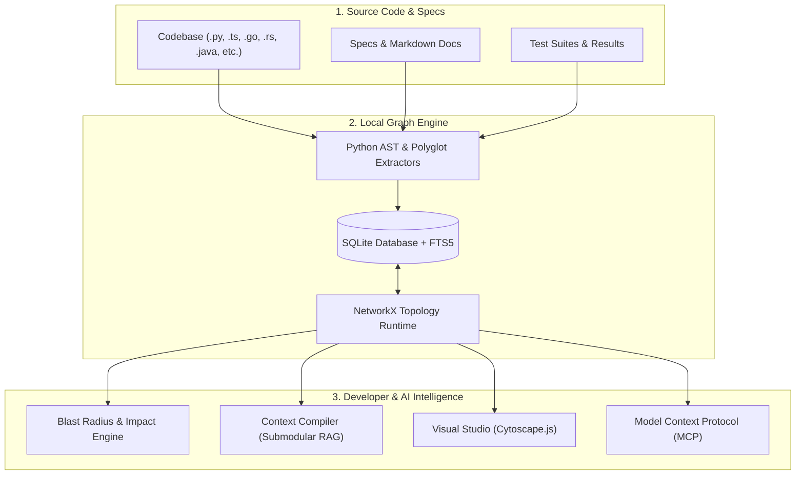

# Agtoosa2 🚀

**The Intelligent Codebase Map for Developers and AI Agents.**

*Like a live GPS and structural blueprint for your code — know what breaks before you touch a line, slash AI token costs by >70%, and ship verified software with zero guesswork.*

[](https://www.python.org/downloads/)
[](https://opensource.org/licenses/MIT)
[](https://sqlite.org/)
[](https://modelcontextprotocol.io/)
[](https://github.com/sky2464/Agtoosa2)

---

## ⚡ Quick Start (60 Seconds)

### 1. Install Agtoosa

**One-Line Automated Install:**

*macOS & Linux:*
```bash
curl -fsSL https://raw.githubusercontent.com/sky2464/Agtoosa2/main/install.sh | bash
```

*Windows (PowerShell):*
```powershell
irm https://raw.githubusercontent.com/sky2464/Agtoosa2/main/install.ps1 | iex
```

**Or Global CLI via Package Manager (Cross-Platform):**
```bash
# Using uv (fastest on macOS, Linux, and Windows):
uv tool install --force git+https://github.com/sky2464/Agtoosa2.git

# Or using pipx (always use --force to cleanly overwrite CLI symlinks):
pipx install --force git+https://github.com/sky2464/Agtoosa2.git

# Or using standard pip:
# macOS & Linux:
python3 -m pip install --upgrade git+https://github.com/sky2464/Agtoosa2.git

# Windows:
py -m pip install --upgrade git+https://github.com/sky2464/Agtoosa2.git
```
> 💡 **Tip:** If switching between `uv` and `pipx`, always specify `--force` so the installer overwrites the existing CLI binary without warning.

**Or From Source (for contributors & developers):**
```bash
git clone https://github.com/sky2464/Agtoosa2.git
cd Agtoosa2

# macOS & Linux:
./install.sh
# (Manual venv: uv venv && source .venv/bin/activate && uv pip install -e '.[full]')

# Windows (PowerShell):
.\install.ps1
# (Manual venv: py -m venv .venv && .venv\Scripts\Activate.ps1 && pip install -e ".[full]")
```

**To Update Agtoosa to Latest at Any Time:**
```bash
# Built-in self update (macOS, Linux, and Windows):
agtoosa update

# Or re-run the universal installer:
# macOS & Linux:
curl -fsSL https://raw.githubusercontent.com/sky2464/Agtoosa2/main/install.sh | bash

# Windows (PowerShell):
irm https://raw.githubusercontent.com/sky2464/Agtoosa2/main/install.ps1 | iex
```

---

### 2. Map Any Project

Navigate to **your project directory** (e.g. your Python, TypeScript, Go, or multi-language repo) and index it:

```bash
cd /path/to/your/project      # (or cd C:\path\to\your\project on Windows)

# Turn on Autopilot (governs Claude, Cursor, Antigravity, Copilot and sets up git hooks)
agtoosa autopilot

# Build the knowledge graph (creates .agtoosa/graph.db locally)
agtoosa graph build

# Launch the interactive visual web studio in your default browser
agtoosa graph view --serve --open
```

> 💡 **Tips:**
> - You can index any project from anywhere with `agtoosa -C /path/to/your/project graph build`.
> - If working inside a virtual environment without activating, prepend `uv run agtoosa ...`.
> - If port 8080 is already occupied by another service, Agtoosa Studio automatically binds to the next available port (e.g. 8081).

---

## 💡 What Agtoosa Does

Agtoosa turns your codebase into a local, queryable **knowledge graph** stored in SQLite (`.agtoosa/graph.db`):

- **100% Local & Zero External Daemons:** No cloud services, no Docker containers, and no code leaves your machine.
- **Instant Blast Radius Prediction:** Predict exactly what functions, API endpoints, and tests will break before making a code change.
- **Surgical AI Context Packs:** Feed AI coding assistants (Claude, Cursor, Copilot) only the precise subgraph they need under a strict token limit, cutting API bills by 70%+.
- **Interactive Visual Studio:** Explore dependencies, architectural clusters, PageRank hubs, and circular dependency warnings in 2D/3D.
- **Verifiable Delivery Gates:** Mathematically trace *User Story → Implementation → Unit Tests → Passing Evidence* before releasing.

---

## 🎬 Everyday Scenarios

### 1. "What breaks if I touch this?" (Blast Radius Analysis)
```bash
agtoosa graph impact AuthService
```
```text
🎯 Blast Radius for symbol 'AuthService' (depth: 3):
   ├── 📁 api/routes/login.py :: handle_login() [CALLS]
   ├── 📁 api/routes/checkout.py :: process_payment() [CALLS]
   ├── 📁 workers/audit.py :: record_user_login() [IMPORTS]
   └── 🧪 tests/test_auth.py :: test_token_refresh() [VERIFIES]
⚠️  Impact Score: 4 files, 12 callers, 2 critical customer endpoints affected.
```

---

### 2. "Give my AI assistant only what it needs" (Stop Wasting Tokens)
Compile a surgical context pack within a strict token budget:
```bash
agtoosa query "PaymentGateway" --budget 1500
```
Agtoosa extracts the exact function signatures, dependency types, and relevant docstrings under 1,500 tokens.

---

### 3. "Clean up zombie code safely" (Dead Code Pruning)
```bash
# Preview dead code with confidence scores and safety explanations
agtoosa refactor dead-code --dry-run --verbose

# Apply pruning with automatic rollback backup
agtoosa refactor dead-code --apply

# Rollback anytime if needed
agtoosa refactor rollback <backup_id>
```

---

### 4. "Is this feature ready to ship?" (Delivery Verification Gate)
```bash
agtoosa ship DEV-001
```
```text
🔍 Verifying Delivery Gate for DEV-001:
   [✓] Spec Defined: User authentication with JWT
   [✓] Code Implemented: agtoosa.auth.jwt_handler (120 LOC)
   [✓] Acceptance Criteria: 3/3 satisfied
   [✓] Test Evidence: tests/test_auth.py (Passed in 0.04s)
==================================================
✅ RELEASE GATE PASSED: DEV-001 is verified and ready to ship!
```

---

### 5. "Did I break architectural rules or introduce cycles?" (Architecture Review)
```bash
agtoosa review
```
```text
🔍 Agtoosa2 Architecture Review Verdict: ✅ [APPROVED]
   • Modified Files Checked: 2
   ✨ Zero architectural drift detected! Layer boundaries and cycles clean.
```
Audit working tree or Git PR branches against layer boundaries, cycles, and blast radius:
```bash
# Review current working tree against a base branch:
agtoosa review --diff main

# Record project architectural rules into persistent memory:
agtoosa review remember "services must never directly query sqlite tables without repository layer"
```

---

## 🤖 Works With Your AI Tools (Native MCP)

Agtoosa runs a native **Model Context Protocol (MCP)** server so AI assistants in **Claude Code, Cursor, Windsurf, or Copilot** can query your codebase map directly.

### Claude Desktop / Claude Code
Add this to your `claude_desktop_config.json`:
```json
{
  "mcpServers": {
    "agtoosa": {
      "command": "agtoosa",
      "args": ["mcp"],
      "cwd": "/path/to/your/project"
    }
  }
}
```
> 💡 **Windows Tip:** In `claude_desktop_config.json` on Windows, format `"cwd"` with forward slashes (e.g. `"C:/Users/username/my-project"`) or escaped backslashes (`"C:\\Users\\username\\my-project"`).

**Native Tools Provided to Your AI:**
- `agtoosa_search_graph` — Search symbols and architectural concepts.
- `agtoosa_get_symbol` — Inspect exact callers and callees.
- `agtoosa_query_impact` — Calculate blast radius before modifying code.
- `agtoosa_compile_context` — Retrieve token-budgeted subgraphs.

---

## 🛠️ Essential Command Cheat Sheet

| Command | What It Does |
|---|---|
| `agtoosa autopilot` | Turn on zero-friction architecture autopilot for AI agents (Claude, Cursor, Copilot) & git hooks |
| `agtoosa graph build [--clean]` | Index or re-index the project into local `.agtoosa/graph.db` |
| `agtoosa graph status` | Check graph stats (files, nodes, connections, freshness) |
| `agtoosa graph view --serve --open` | Launch the interactive visual web studio (port 8080 with auto-port fallback) |
| `agtoosa review [--diff main]` | Audit working tree / PR diff for layer violations, cycles, and blast radius |
| `agtoosa review remember "<rule>"` | Store project architectural rules and invariants into codebase memory |
| `agtoosa graph impact <symbol>` | Calculate blast radius and upstream caller chain |
| `agtoosa graph query "<query>"` | Search symbols, types, and concepts with FTS5 lexical ranking |
| `agtoosa query "<target>" --budget 1500` | Compile surgical AI context pack under a token limit |
| `agtoosa graph explain <symbol>` | Deep explanation of an entity, relationships, and source links |
| `agtoosa graph path <Source> <Target>` | Trace connection paths between any two components |
| `agtoosa refactor dead-code` | Detect and prune unused functions and zombie classes |
| `agtoosa ship [STORY_ID]` | Verify release delivery gate (Story → Code → Test evidence) |
| `agtoosa guard --daemon` | Run pre-push drift guard in the background |
| `agtoosa mcp` | Launch native Model Context Protocol server on stdio |
| `agtoosa update` | Self-update Agtoosa to the latest version from GitHub |

---

## 🔬 Under the Hood



- **Zero-Dependency Core:** Python 3.11+ standard library + local transactional SQLite with FTS5 search.
- **Multi-Language Parsing:** Full standard-library AST for Python; dedicated extractors for TypeScript/JavaScript, Go, Rust, Java, Kotlin, C/C++, C#, Shell, SQL DDL, and Dockerfile.
- **Sub-Second Performance:** Incremental hashing skips unchanged files; queries and blast radius resolve in milliseconds.

---

## 📚 Documentation & Specifications

- 🗺️ **[Master Plan](docs/Master-Plan.md):** Complete project roadmap, milestones, and delivery stages.
- 🏛️ **[Master Architecture](docs/Master-Architecture.md):** Formal C4 diagrams, container boundaries, and schemas.
- 📊 **[Capability Matrix](docs/Capability-Matrix.md):** Complete feature parity and reference capabilities.
- 🛡️ **[EPIC-001: Trusted Knowledge Intelligence](docs/specs/epic-001-trusted-knowledge-intelligence.md):** Extraction precision and graph truth.
- 🤝 **[Contributing Guidelines](AGENTS.md):** Code style, module organization, and testing workflows.

---

## 📄 License

Agtoosa2 is open-source software licensed under the **[MIT License](LICENSE)**.