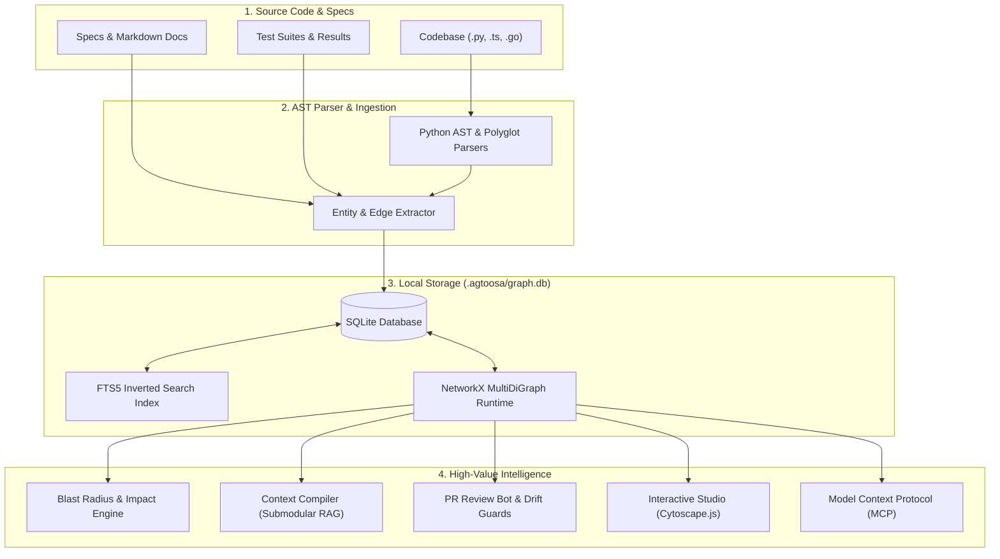

# Agtoosa2 🚀

**The Intelligent Codebase Map for Developers and AI Agents.**

*Like a live GPS and structural blueprint for your code — know what breaks before you touch a line, slash AI token costs by >70%, and ship verified software with zero guesswork.*

[](https://www.python.org/downloads/)
[](https://opensource.org/licenses/MIT)
[](https://sqlite.org/)
[](https://modelcontextprotocol.io/)
[](https://github.com/sky2464/Agtoosa2)

---

## 💡 What is Agtoosa2? (The 30-Second Explanation)

Imagine remodeling a house. You wouldn't swing a sledgehammer into a wall without checking the blueprint to see if it's load-bearing, right?

Yet in software development, engineers and AI coding assistants do that every single day:
- **Blind edits:** You rename or update a function in one file, only to find out hours later that it quietly broke three payment endpoints and an invoice report in completely different folders.
- **AI token waste & hallucinations:** You feed an AI assistant (like Claude, Cursor, or Copilot) entire folders of code. The AI gets overwhelmed, burns through expensive API tokens, hallucinates, or misses the real issue.
- **Unverified releases:** Teams merge code based on "looks good to me" PR reviews, but nobody can prove whether the new code actually satisfies the original feature requirements.

**Agtoosa2 solves this by building a living, queryable map (a knowledge graph) of your entire project.** 

Instead of treating your codebase like a bucket of disconnected text files, Agtoosa parses your real code syntax into connected dots:
- **Files, classes, functions, and API routes**
- **User stories and acceptance criteria**
- **Unit tests and verification evidence**

Everything is stored in a single, lightweight SQLite file (`.agtoosa/graph.db`) right on your computer. **No cloud servers. No monthly SaaS bills. No proprietary code leaving your machine.**

---

## 💼 Why Businesses and Engineering Teams Use Agtoosa2

| The Pain Today | What Agtoosa2 Does | Business & Engineering Impact |
|---|---|---|
| **The AI Token Tax**<br>AI coding agents ingest hundreds of raw files blindly. | **Graph Context Compilation**<br>Gives the AI agent *only* the exact functions and types it needs (with token budgeting). | 📉 **Cuts AI API bills by 70%+** and dramatically reduces AI hallucinations. |
| **The "Blast Radius" Panic**<br>Developers are terrified of refactoring legacy code because they don't know what will break. | **Instant Impact Prediction (`agtoosa graph impact`)**<br>Calculates the exact upstream call chain across code, APIs, and tests before you save. | 🛡️ **Zero accidental outages.** Refactor with total confidence. |
| **"Did We Actually Ship It?"**<br>PRs get merged, but teams rely on manual Jira checklists and hope tests covered the spec. | **Verifiable Delivery Gates (`agtoosa ship`)**<br>Mathematically verifies: *Story → Implemented Code → Automated Tests → Passing Evidence*. | 🚀 **Guaranteed feature delivery.** No missed criteria, no broken promises in production. |
| **Privacy & Infrastructure Hassle**<br>Most enterprise code tools require cloud databases, Docker containers, or sending code to 3rd parties. | **100% Local & Zero External Daemons**<br>Runs on standard Python with a local SQLite database and instant FTS5 search. | 🔒 **Zero data leakage.** Full security compliance, instant setup, and zero infrastructure cost. |

---

## 🎬 See It in Action (Everyday Scenarios)

### 1. "What breaks if I touch this?" (Blast Radius Analysis)
Before you edit or delete `AuthService`, ask Agtoosa who depends on it:
```bash
agtoosa graph impact AuthService
```
```text
🎯 Blast Radius for symbol 'AuthService' (depth: 3):
   ├── 📁 api/routes/login.py :: handle_login() [CALLS]
   ├── 📁 api/routes/checkout.py :: process_payment() [CALLS]
   ├── 📁 workers/audit.py :: record_user_login() [IMPORTS]
   └── 🧪 tests/test_auth.py :: test_token_refresh() [VERIFIES]
⚠️  Impact Score: 4 files, 12 callers, 2 critical customer endpoints affected.
```
*You instantly know every file, route, and test you need to be aware of before making a single change.*

---

### 2. "Give my AI agent only what it needs" (Stop Wasting Tokens)
Instead of feeding 50 full files into Cursor or Claude Code, compile a surgical context pack under a strict token limit:
```bash
agtoosa query "PaymentGateway" --budget 1500
```
Agtoosa extracts the exact function signatures, dependency types, and relevant docstrings within your 1,500 token limit. Your AI gets immediate clarity without the noise.

---

### 3. "Clean up the clutter" (Safe Dead Code Pruning)
Identify zombie functions, orphaned classes, and unused files that slow down your team:
```bash
# Preview dead code with confidence scores and safety explanations
agtoosa refactor dead-code --dry-run --verbose

# Safely prune dead code with automatic rollback snapshot support
agtoosa refactor dead-code --apply
```
Made a mistake? Every refactor creates an atomic backup snapshot you can revert in one command:
```bash
agtoosa refactor rollback <backup_id>
```

---

### 4. "Is this feature really ready to ship?" (Verifiable Quality Gates)
Prove that story `DEV-001` is genuinely finished before merging:
```bash
agtoosa ship DEV-001
```
```text
🔍 Verifying Delivery Gate for DEV-001:
   [✓] Spec Defined: User authentication with JWT
   [✓] Code Implemented: agtoosa.auth.jwt_handler (120 LOC)
   [✓] Acceptance Criteria: 3/3 satisfied
   [✓] Test Evidence: tests/test_auth.py (Passed in 0.04s)
   ==================================================
   ✅ RELEASE GATE PASSED: DEV-001 is verified and ready to ship!
```

---

## 🌐 Interactive Visual Studio: See Your Code Come to Life

Agtoosa comes with a built-in interactive web studio. Explore your codebase in 2D/3D, click on nodes to trace dependencies, and spot architectural bottlenecks visually:

```bash
# Launch Agtoosa Studio on localhost:8080 and open your browser automatically
agtoosa graph view --serve --open
```

- 🔍 **Interactive Graph Explorer:** Search any symbol and watch its call paths light up.
- 🔄 **Cycle Detection:** Spot circular dependencies (`A imports B imports A`) in red before they cause runtime bugs.
- 🌟 **Hub Ranking (PageRank):** See which core modules are the most critical foundations of your project.

---

## 🤖 Works With the AI Tools You Already Use (Native MCP)

Agtoosa2 speaks the **Model Context Protocol (MCP)**, the open standard for AI tools. That means your AI assistants in **Claude Code, Cursor, Windsurf, Copilot, or Gemini CLI** can query your project graph directly instead of guessing!

To start the MCP server:
```bash
agtoosa mcp
```

### Connect to Claude Desktop or Claude Code
Add this to your `claude_desktop_config.json`:
```json
{
  "mcpServers": {
    "agtoosa": {
      "command": "agtoosa",
      "args": ["mcp"],
      "cwd": "/path/to/your/project"
    }
  }
}
```

Now your AI assistant has native tools:
- `agtoosa_search_graph` — Search all symbols and concepts.
- `agtoosa_get_symbol` — Inspect exact callers and callees.
- `agtoosa_query_impact` — Calculate blast radius before writing code.
- `agtoosa_compile_context` — Read surgical, token-budgeted subgraphs.

---

## 🔬 Under the Hood (For Computer Science & Engineering Minds)

How does Agtoosa achieve sub-second speeds and zero cloud dependency?



1. **Abstract Syntax Tree (AST) & Polyglot Parsing:**  
   Agtoosa parses Python using standard-library AST and extracts entities and dependencies across JavaScript, TypeScript, Go, Rust, Java, C/C++, C#, Shell, SQL DDL, and Dockerfiles with specialized language extraction engines, mapping true semantic entities (`File`, `Class`, `Function`, `Route`) and relations (`CALLS`, `IMPORTS`, `DEFINES`).
2. **Deterministic Graph Topology:**  
   In-memory graph processing uses directed multigraphs (`NetworkX`) to calculate graph centrality (PageRank), cycle bisection (Feedback Arc Set), and topological paths in milliseconds.
3. **SQLite FTS5 + Hybrid Retrieval:**  
   All entity metadata, full-text indexes, and delivery state live inside a local transactional SQLite database with FTS5 lexical ranking and optional dense vector embeddings.
4. **Token-Budgeted Submodular Optimization:**  
   When compiling context for AI agents, Agtoosa selects maximum-information subgraphs that strictly fit within your target token budget (e.g., 1,500 tokens), preventing prompt dilution.

---

## ⚡ Quick Start (Up and Running in 60 Seconds)

### 1. Requirements
- Python 3.11 or newer.
- macOS, Linux, or Windows (WSL / PowerShell).

### 2. Installation

**Option A — Standard pip:**
```bash
# Clone the repository
git clone https://github.com/sky2464/Agtoosa2.git
cd Agtoosa2

# Create and activate a virtual environment
python3 -m venv .venv
source .venv/bin/activate

# Upgrade pip and install (clean, zero-warning install)
pip install --upgrade pip
pip install --no-cache-dir -e '.[full]'
```

**Option B — [uv](https://github.com/astral-sh/uv) (sub-second, zero noise):**
```bash
# Clone the repository
git clone https://github.com/sky2464/Agtoosa2.git
cd Agtoosa2

# Create a virtual environment and install
uv venv
uv pip install -e '.[full]'
source .venv/bin/activate
```

**⚠️ Important:** After installation, navigate to your own project directory to use Agtoosa. Do not run Agtoosa commands in the Agtoosa installation directory itself, as this will index the Agtoosa source code instead of your project. If you accidentally run it in the Agtoosa directory, you'll see a warning message.

### 3. Build Your First Graph
Navigate to your own project directory (not the Agtoosa installation directory) and index your repository into `.agtoosa/graph.db` with one command:
```bash
cd /path/to/your/project
agtoosa graph build
```

**Important:** Always run `agtoosa graph build` in your own project directory, not in the Agtoosa installation directory. Running it in the Agtoosa project directory will index the Agtoosa source code itself, which is not what you want for analyzing your own projects. If you accidentally run it in the Agtoosa directory, you'll see a warning message.

### 4. Check Health and Launch Studio
```bash
# Check graph stats (number of files, symbols, and connections)
agtoosa graph status

# View the architectural health report (cycles, bottlenecks, hotspots)
agtoosa graph report

# Launch the visual web studio in your browser
agtoosa graph view --serve --open
```

---

## 🛠️ Essential Command Cheat Sheet

| Task | Command |
|---|---|
| **Build/rebuild graph** | `agtoosa graph build [--clean]` |
| **Check graph status** | `agtoosa graph status` |
| **Search symbols & concepts** | `agtoosa graph query "AuthToken"` |
| **Inspect symbol callers/callees** | `agtoosa graph explain <symbol>` |
| **Trace path between two components** | `agtoosa graph path <Source> <Destination>` |
| **Check blast radius before editing** | `agtoosa graph impact <symbol>` |
| **Find dead code / zombie functions** | `agtoosa refactor dead-code` |
| **Compile AI context pack under budget** | `agtoosa query "<target>" --budget 1500` |
| **Verify readiness & delivery gate** | `agtoosa ship [DEV-XXX]` |
| **Run local visual web studio** | `agtoosa graph view --serve --open` |
| **Start background pre-push guard** | `agtoosa guard --daemon` |
| **Launch native MCP server** | `agtoosa mcp` |

---

## 📚 Deep Dive Documentation

For detailed architectural specifications and design decisions, check out:

- 🗺️ **[Master Plan](docs/Master-Plan.md):** Complete project roadmap, delivery stages, and milestones.
- 🏛️ **[Master Architecture](docs/Master-Architecture.md):** Formal C4 diagrams, container boundaries, and data schemas.
- 📝 **[ADR-001: Unified Graph-Native Architecture](docs/adr/ADR-001-unified-graph-native-architecture.md):** Design record behind the Python graph engine.
- 📊 **[Capability Matrix](docs/Capability-Matrix.md):** Complete feature parity and reference capabilities.
- 🛡️ **[EPIC-001: Trusted Knowledge Intelligence](docs/specs/epic-001-trusted-knowledge-intelligence.md):** Specification for extraction precision and graph truth.
- 🔬 **[Graphify Parity & Graph Trust](docs/research/2026-09-13-graphify-parity-and-trust.md):** Research findings behind knowledge extraction accuracy.
- ⚙️ **[DEV-001 Specification](docs/specs/spec-DEV-001-native-graph.md):** Native graph store and query engine.
- 🎨 **[DEV-005 Specification](docs/specs/spec-DEV-005-visualizer-and-reports.md):** Interactive visualizer, reporting, and studio.

---

## 🤝 Contributing & License

We welcome contributions! Please review [AGENTS.md](AGENTS.md) for codebase guidelines, coding standards, and testing workflows.

Agtoosa2 is open-source software licensed under the **[MIT License](LICENSE)**.