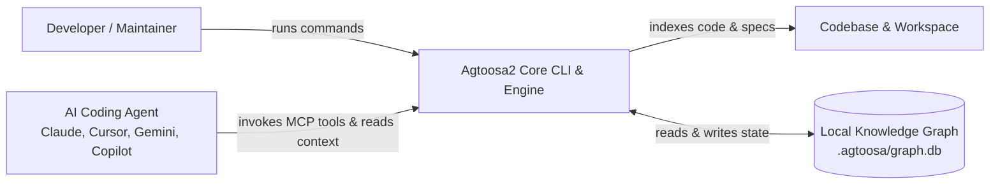
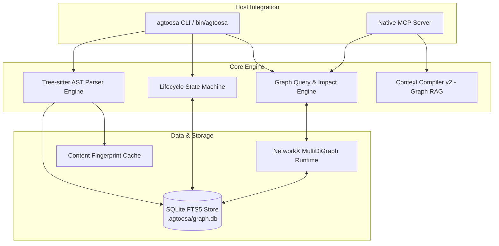

# Agtoosa2 — Master Architecture

> **Architecture Document for Agtoosa Revision 2**
> **Core Concept:** Unified Graph-Native Engineering Operating System.

---

## 1. Architectural Mission

Agtoosa2 unifies code comprehension, project planning, and delivery assurance into a single, queryable knowledge graph. Instead of relying on fragile text templates and duplicate shell scripts, Agtoosa2 delivers a Python 3.11+ engine that parses abstract syntax trees (ASTs), tracks engineering specifications and tasks, compiles bounded context for AI coding agents, and mathematically verifies lifecycle gates before release.

---

## 2. Quality Attributes & Design Principles

| Attribute | Target | Architectural Mechanism |
|---|---|---|
| **Simplicity** | Single cross-platform runtime | Modern Python 3.14+ CLI replacing dual Bash/PowerShell codebases. |
| **Performance** | Sub-second queries, fast indexing | SQLite transactional storage with FTS5 inverted indexes and NetworkX in-memory graphs. |
| **Token Efficiency** | >70% context reduction for LLMs | Graph-compiled Context Packs (Context RAG v2) instead of giant static prompt dumps. |
| **Integrity** | Mathematical proof of readiness | Graph invariant verification for `Spec → Build → Review → Ship` transitions. |
| **Zero Bloat** | Low dependency footprint | Self-contained project-local `.agtoosa/` storage; no external database servers or daemons required. |

---

## 3. C4 Architecture Models

### 3.1 System Context



### 3.2 Container Architecture



---

## 4. Unified Graph Data Model

The core storage model in `.agtoosa/graph.db` consists of:

### 4.1 Node Categories

```
┌────────────────────────────────────────────────────────────────────────┐
│                          Unified Node Schema                           │
├─────────────────┬──────────────────┬─────────────────┬─────────────────┤
│ Implementation  │ Specification    │ Verification    │ Provenance      │
├─────────────────┼──────────────────┼─────────────────┼─────────────────┤
│ • File          │ • Epic           │ • TestCase      │ • Commit        │
│ • Module        │ • Story (DEV-XX) │ • TestRun       │ • Snapshot      │
│ • Class         │ • Criterion      │ • Evidence      │ • Fingerprint   │
│ • Function      │ • Task           │ • ReviewSignoff │ • Author        │
│ • Package       │ • ADR / Decision │                 │                 │
└─────────────────┴──────────────────┴─────────────────┴─────────────────┘
```

### 4.2 Edge Semantics
- `CALLS`: Function A calls Function B.
- `IMPORTS`: Module A imports Symbol B.
- `DEFINES`: File A defines Class/Function B.
- `IMPLEMENTS`: Symbol A implements Task/Criterion B.
- `VERIFIES`: Test A verifies Criterion B.
- `EVIDENCED_BY`: Test/Story A is backed by Evidence B.
- `DEPENDS_ON`: Node A requires Node B.

---

## 5. Failure Containment & Degradation

1. **Non-destructive Storage**: All generated graph data is strictly stored in `.agtoosa/graph.db` and can be reconstructed cleanly via `agtoosa graph build --clean`.
2. **Graceful Fallback**: If Python dependencies or the graph database are temporarily unavailable, core project files and documentation remain standard human-readable Markdown and code.
3. **Atomic Writes**: Database updates run inside SQLite transactions; interrupted runs leave the previous valid graph snapshot intact.
