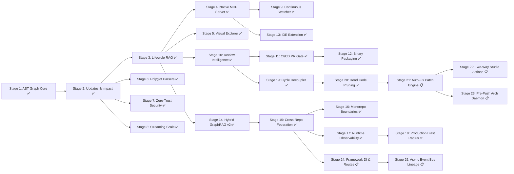

# Agtoosa2 — Master Plan

> **Source of truth for Agtoosa Revision 2 development.**
> **Architecture:** Unified Graph-Native Engineering Operating System.

## Project Charter

| Field | Value |
|---|---|
| Product | `Agtoosa2` |
| Repository | `https://github.com/sky2464/Agtoosa2` |
| Version | `0.4.0` (GA Released) |
| Core Engine | Python 3.11+ (Tree-sitter, SQLite FTS5, NetworkX) |
| Active Cycle | `DEV-021` (Stage 21: Autonomous AST Patch Engine) |
| Current Milestone | `v0.5.0` (Milestone 9: Autonomous Code Actions & 2-Way Studio Sync) |

---

## Active Cycle

| ID | Title | Type | Status | Primary Deliverable |
|---|---|---|---|---|
| **DEV-021** | Autonomous AST Patch Engine | Feature | 📋 In Progress | AST rewriting engine applying safe dead-code deletions and dependency inversion interface abstractions to source files |

---

## Planned Cycles

| ID | Title | Type | Status | Primary Deliverable |
|---|---|---|---|---|
| **DEV-021** | Autonomous AST Patch Engine | Feature | 📋 In Progress | AST rewriting engine applying safe dead-code deletions and dependency inversion interfaces to source files |
| **DEV-022** | Two-Way Interactive Studio Actions | Feature | 📋 Planned | Web Studio action backend: 1-click "Safe Prune" & "Decouple Cycle" executing git branch and commit diffs |
| **DEV-023** | Pre-Push Architectural Daemon & Drift Linter | Feature | 📋 Planned | Pre-commit/pre-push guard daemon enforcing zero circular dependencies and blast radius thresholds |
| **DEV-024** | Framework Dependency Injection & Dynamic Routes | Feature | 📋 Planned | AST extractors for FastAPI, Flask, Express, NestJS DI containers and ORM relation mapping |
| **DEV-025** | Async Message Queue & Event Bus Lineage | Feature | 📋 Planned | Event-driven graph lineage for Kafka, RabbitMQ, Redis Pub/Sub, and Celery background task graphs |

---

## Completed Cycles

| ID | Title | Type | Status | Primary Deliverable |
|---|---|---|---|---|
| **DEV-001** | Core Foundation & AST Knowledge Graph | Feature | ✅ Done | Unified CLI, polyglot AST extractors (Py/JS/TS/Sh), SQLite FTS5 graph store, `/agtoosa graph build/query/status/export` |
| **DEV-002** | Reliable Incremental Updates & Investigation | Feature | ✅ Done | Content hash fingerprints, incremental sync, `/agtoosa graph explain/path/impact` |
| **DEV-003** | Graph-Driven Lifecycle & Context Compilation v0.2 | Feature | ✅ Done | Spec/Story/Criteria/Task ingestion, Context Compiler v0.2 (Graph RAG), `review`, and mathematical proof `ship` gates |
| **DEV-004** | Native Model Context Protocol (MCP) Server | Feature | ✅ Done | Built-in stdio/SSE MCP server exposing real-time graph navigation tools to AI coding agents |
| **DEV-005** | Interactive Architecture Exploration & Visualizer | Feature | ✅ Done | Offline Cytoscape.js HTML visualizer (`agtoosa graph view`), architecture health & cycle reports (`agtoosa graph report`), and multi-format exports (Obsidian, GraphML, Cypher, DOT) |
| **DEV-006** | Broad Polyglot Language & Schema Coverage | Feature | ✅ Done | Polyglot parser supporting Go, Rust, Java, Kotlin, C/C++, C#, SQL DDL, and Dockerfile |
| **DEV-007** | Zero-Trust Security Hardening | Security | ✅ Done | Visualizer CSP & anti-XSS serialization; workspace sandboxing & symlink guards; .gitignore enforcement; secret redaction; MCP depth & line clamps; SQLite PRAGMA hardening |
| **DEV-008** | High-Scale Performance & Streaming Optimization | Performance | ✅ Done | O(1) memory chunked streaming (`stream_nodes`, `stream_edges`); in-database recursive SQL CTE for impact traversal; single-pass compound FTS5 queries |
| **DEV-009** | Continuous Watcher & MCP Push | Feature | ✅ Done | Zero-dependency filesystem watcher (`agtoosa graph watch`), Git hooks (`agtoosa graph hooks`), live MCP resource update notifications |
| **DEV-010** | Review Intelligence & Architecture Drift Alarms | Feature | ✅ Done | Layer boundary enforcement, cyclic dependency alarms, blast radius warnings, PR diff analysis (`agtoosa review --diff`), and Architectural Memory Bank (`agtoosa review remember/reflect`) |
| **DEV-011** | CI/CD Quality Gate & GitHub Action Integration | Feature | ✅ Done | Composite GitHub Action (`action.yml`), reference CI workflow, PR architectural impact markdown comment generator, CLI `agtoosa ci review/check` |
| **DEV-012** | Standalone Binary Packaging & Multi-Platform Distribution | DevOps | ✅ Done | Standalone PyInstaller executable (`agtoosa.spec`), build orchestrator (`scripts/build_standalone.py`), Homebrew formula (`Formula/agtoosa.rb`), release workflow |
| **DEV-013** | VS Code & Cursor IDE Extension | Extension | ✅ Done | Native extension package (`extension/`), architecture tree views, real-time CodeLens blast radius, CLI `agtoosa graph symbols` |
| **DEV-014** | Hybrid GraphRAG v2 & Semantic Vector Search | Feature | ✅ Done | Zero-dependency dense vector embeddings (`node_embeddings` BLOBs), RRF lexical + semantic search, `compile_context --hybrid`, CLI & MCP |
| **DEV-015** | Cross-Repo Graph Federation | Feature | ✅ Done | Multi-repository graph ingestion (`agtoosa graph federate`), OpenAPI/gRPC/GraphQL contract bindings, distributed cross-service blast radius |
| **DEV-016** | Monorepo Package Boundary Enforcement | Feature | ✅ Done | Monorepo workspace discovery, encapsulation leak detection, undeclared dependencies, package cycles, `agtoosa review boundaries` |
| **DEV-017** | OpenTelemetry & Profiler Heatmap Overlay | Feature | ✅ Done | OpenTelemetry span / profiler ingestion, execution latency & call frequency heatmaps |
| **DEV-018** | Production Blast Radius | Feature | ✅ Done | Runtime telemetry traffic weighting, live error rates, caller risk multipliers, and dormant dependency detection |
| **DEV-019** | Autonomous Cycle Decoupling Engine | Feature | ✅ Done | Automated dependency inversion, shared kernel, and event-driven decoupling blueprints with executable code stubs |
| **DEV-020** | Dead Code & Zombie Symbol Pruning | Feature | ✅ Done | Unreachable AST node detection, confidence scoring, entrypoint exclusion, safe deletion refactoring blueprints |

---

## Strategic Roadmap & Delivery Stages

### Milestone 1: Knowledge Engine Core (v0.2.0-alpha)
- **DEV-001 (Stage 1) — Core Foundation & AST Knowledge Graph** [✅ Done]
  - Python 3.11+ packaging, zero-service architecture, single `agtoosa` CLI.
  - Parsers for Python, JavaScript/TypeScript, and Shell.
  - SQLite transactional schema + FTS5 full-text indexing.
  - Commands: `agtoosa graph build`, `agtoosa graph query`, `agtoosa graph status`, `agtoosa graph export`.
- **DEV-002 (Stage 2) — Reliable Incremental Updates & Investigation** [✅ Done]
  - Content hash fingerprints, rename and deletion handling.
  - Commands: `agtoosa graph explain <symbol>`, `agtoosa graph path <from> <to>`, `agtoosa graph impact <target>`.

### Milestone 2: Lifecycle Integration & Agent Context (v0.2.0-beta)
- **DEV-003 (Stage 3) — Graph-Driven Lifecycle & Context Compilation v0.2** [✅ Done]
  - Ingestion of Story, Criterion, Task, and Test nodes into the knowledge graph.
  - Context RAG v0.2: Bounded subgraph prompt compilation replacing bloated markdown templates.
  - Lifecycle state machine: `agtoosa review` and mathematical proof graph validation on `agtoosa ship`.
- **DEV-004 (Stage 4) — Native Model Context Protocol (MCP) Server** [✅ Done]
  - Built-in MCP server (`agtoosa mcp`) providing real-time tools for Cursor, Claude Code, Windsurf, Gemini, and Copilot.
  - Tools: `get_symbol_context`, `query_impact_radius`, `get_active_task_context`, `record_task_evidence`, `agtoosa_watch_status`.

### Milestone 3: Production Hardening, Scale & Breadth (v0.2.0-rc.2)
- **DEV-005 (Stage 5) — Interactive Architecture Exploration & Visualizer** [✅ Done]
  - Bundled standalone offline viewer (`agtoosa graph view`).
  - Community clustering, PageRank importance scoring, cycle detection, health scorecard (`agtoosa graph report`).
  - Multi-format exports: Markdown wiki / Obsidian vault, GraphML, Cypher, DOT.
- **DEV-006 (Stage 6) — Broad Polyglot Language & Schema Coverage** [✅ Done]
  - Polyglot parser supporting Go, Rust, Java, Kotlin, C/C++, C#, SQL DDL tables & views, and Dockerfiles.
- **DEV-007 (Stage 7) — Zero-Trust Security Hardening** [✅ Done]
  - Strict Content-Security-Policy & anti-XSS HTML escaping in visualizer.
  - Workspace scanner sandboxing, canonical path boundary checks, and symlink escape defenses.
  - Automated regex secret and private key redaction in nodes and docstrings.
  - .gitignore pattern loading and enforcement during workspace scans.
  - MCP JSON-RPC protocol max depth and line byte clamping.
- **DEV-008 (Stage 8) — High-Scale Performance & Streaming Optimization** [✅ Done]
  - O(1) memory footprint chunked generators (`stream_nodes`, `stream_edges`).
  - In-database SQLite `WITH RECURSIVE` CTE for blast radius calculations (`compute_impact`).
  - Single-pass compound boolean FTS5 query optimization in Context Compiler.

### Milestone 4: Operational Intelligence & Automation (v0.2.0-GA)
- **DEV-009 (Stage 9) — Continuous Watcher & MCP Push Notifications** [✅ Done]
  - Background filesystem watcher (`agtoosa graph watch`), incremental sync on save with debouncing.
  - Automated Git hook management (`agtoosa graph hooks install/remove/status`).
  - Real-time MCP resource notifications (`notifications/resources/updated`) for connected AI assistants.
- **DEV-010 (Stage 10) — Review Intelligence & Architecture Drift Alarms** [✅ Done]
  - Architectural tier hierarchy enforcement (Tier 1 Entrypoints -> Tier 2 Application/Engine -> Tier 3 Domain Core).
  - Cyclic dependency alarms and high blast radius warnings.
  - Git PR line-level diff to graph symbol mapping (`agtoosa review --diff <base-ref>`).
  - Institutional Architectural Memory Bank (`agtoosa review remember/reflect`) with automatic prompt injection.

### Milestone 5: Ecosystem, Packaging & CI/CD Intelligence (v0.2.x)
- **DEV-011 (Stage 11) — CI/CD Quality Gate & GitHub Action Integration** [✅ Done]
  - Composite GitHub Action (`action.yml`) running `agtoosa review --diff origin/main --strict`.
  - Automated rich PR architectural impact markdown comment generator.
  - Merge blocking on circular dependencies or layer boundary regressions.
- **DEV-012 (Stage 12) — Standalone Binary Packaging & Distribution** [✅ Done]
  - Standalone compiled executables (macOS Apple Silicon/Intel, Linux x86_64, Windows x64).
  - Automated GitHub Releases matrix, Homebrew tap formula, PyPI publication.
- **DEV-013 (Stage 13) — VS Code & Cursor IDE Extension** [✅ Done]
  - In-editor architecture tree view, caller/callee inspection, code lens annotations, and real-time blast radius alerts.
- **DEV-014 (Stage 14) — Hybrid GraphRAG v2 & Semantic Vector Search** [✅ Done]
  - Embedded zero-dependency dense vector embeddings, cosine similarity + FTS5 + graph CTE hybrid prompt compiler.
  - Reciprocal Rank Fusion (RRF) search, CLI `agtoosa graph embeddings build/status`, `agtoosa context compile --hybrid`, MCP `agtoosa_hybrid_search`.

### Milestone 6: Enterprise Federation & Microservices (v0.3.0)
- **DEV-015 (Stage 15) — Cross-Repo Graph Federation** [✅ Done]
  - Multi-repository workspace graph ingestion (`agtoosa graph federate <git-url>`).
  - Distributed blast radius across microservices (OpenAPI/Swagger, gRPC `.proto`, GraphQL schema bindings).
- **DEV-016 (Stage 16) — Monorepo Package Boundary Enforcement** [✅ Done]
  - Workspace package encapsulation policies (`packages/*` boundaries).
  - Alarms preventing internal non-exported module leakage across packages.
  - Verification CLI `agtoosa review boundaries [--strict]`.

### Milestone 7: Runtime Observability & Dynamic Heatmaps (v0.3.5)
- **DEV-017 (Stage 17) — OpenTelemetry & Profiler Heatmap Overlay** [✅ Done]
  - Ingest OpenTelemetry trace spans or PySpy profiler data into the knowledge graph.
  - Live call frequency, execution latency, and error-rate color heatmaps in C4 visualizer.
- **DEV-018 (Stage 18) — Production Blast Radius** [✅ Done]
  - Weight static AST caller graphs with real-time production traffic percentages.

### Milestone 8: Autonomous Architecture Refactoring Engine (v0.4.0)
- **DEV-019 (Stage 19) — Automated Cycle Decoupling** [✅ Done]
  - Interactive CLI / agent engine to automatically generate dependency injection interfaces or event-driven adapters that resolve cyclic dependencies detected by Tarjan's algorithm.
- **DEV-020 (Stage 20) — Dead Code & Zombie Symbol Pruning** [✅ Done]
  - Identify zero-caller unreachable AST nodes and generate safe deprecation/deletion refactors.
  - Confidence scoring (low/medium/high), entrypoint exclusion, CLI `agtoosa refactor dead-code`, MCP `agtoosa_detect_dead_code`.

### Milestone 9: Autonomous Code Actions & 2-Way Studio Sync (v0.4.1)
- **DEV-021 (Stage 21) — Autonomous AST Patch Engine** [📋 In Progress]
  - AST rewriting engine applying safe dead-code deletions and dependency inversion interface abstractions to source files.
  - Generates atomic Git diff patches with rollbacks.
  - CLI: `agtoosa refactor apply --plan <plan-id> [--dry-run]`.
- **DEV-022 (Stage 22) — Two-Way Interactive Studio Actions** [📋 Planned]
  - Embedded HTTP mutation endpoints inside Agtoosa Studio web interface.
  - Direct 1-click **"Safe Prune"** button in Dead Code table and **"Decouple Loop"** in Cycle Decoupler.
  - Creates dedicated git branches and commits directly from the browser UI.
- **DEV-023 (Stage 23) — Pre-Push Architectural Daemon & Drift Linter** [📋 Planned]
  - Background daemon and pre-push Git hook preventing commits with cyclic dependencies or layer boundary breaches.
  - CLI: `agtoosa guard [--install-hooks] [--daemon]`.

### Milestone 10: Deep Polyglot Framework Semantics & Distributed Event Lineage (v0.4.2)
- **DEV-024 (Stage 24) — Framework Dependency Injection & Dynamic Routes** [📋 Planned]
  - AST extractors for FastAPI, Flask, Express, NestJS DI containers, route decorators, and ORM relation mapping (SQLAlchemy, Prisma, Django).
- **DEV-025 (Stage 25) — Async Message Queue & Event Bus Lineage** [📋 Planned]
  - Event-driven graph lineage for Kafka topics, RabbitMQ queues, Redis Pub/Sub channels, and Celery background task call trees.

---

## Architectural Refactoring Track: Modular Native Studio (Zero Build Tools)

> **Objective:** Eliminate the 3,000-line monolithic `f-string` in `agtoosa/graph/visualizer.py` by decoupling it into clean, maintainable, modular native assets under `agtoosa/graph/web/` without introducing external Node/Bun/Vite dependencies, adhering strictly to the zero-service Python 3.11+ charter in `draft.md`.

### Core Architectural Contracts
- **Zero External Tooling:** Pure standard HTML5, CSS3, and native ES Modules. No Node.js, Bun, or npm required at runtime or build time.
- **Strict Size Budget:** `index.html` < 150 lines; all CSS and JS component modules < 250 lines each.
- **Python Engine Footprint:** `visualizer.py` reduced from 2,979 lines to < 200 lines (focused solely on data extraction and asset bundling).
- **Zero-Collision Escaping:** Eliminates all Python f-string escaping issues (`{{}}` and `${{}}`).
- **Dual-Mode Serving:**
  - *Dev / Local Mode:* Dynamically loads separate CSS/JS assets from `agtoosa/graph/web/` for instant editing and debugging.
  - *Portable Offline Export Mode:* Lightweight Python single-file bundler inlines assets into a self-contained `.agtoosa/graph_view.html` for offline sharing.

### Work Breakdown & Traceable Tasks
- [ ] **TASK-WEB-01: Asset Directory & Template Architecture**
  - Create `agtoosa/graph/web/` with subdirectories `css/` and `js/`.
  - Establish `index.html` semantic layout shell (< 150 lines) with `<header id="top-nav">`, `<section id="kpi-ribbon">`, `<main id="view-container">`, `<aside id="sidebar">`, and modal overlays.
- [ ] **TASK-WEB-02: Modular CSS Token & View Separation**
  - Extract `theme.css` (< 100 lines): CSS variables, design tokens, typography, and glassmorphism styling.
  - Extract `layout.css` (< 150 lines): Flexbox top navigation, omni-search bar, KPI ribbon, docked drawer, and responsive media queries.
  - Extract `views.css` (< 250 lines): Component styles for C4 Blueprint, 2D Network Canvas, Risk Radar tables, and Blast Radius flow columns.
- [ ] **TASK-WEB-03: ES Module Script Decomposition**
  - Extract `state.js` (< 80 lines): Central reactive state, active perspective, selection, and telemetry toggle.
  - Extract `c4_view.js` (< 200 lines): Cytoscape.js initialization, compound domain clustering, and layout controls.
  - Extract `network_view.js` (< 250 lines): 2D Canvas sunflower spiral engine, pan/zoom, domain camera centering, and search highlighting.
  - Extract `blast_view.js` (< 180 lines): Blast radius column flow, telemetry weighting, and production risk badges.
  - Extract `radar_view.js` (< 200 lines): Centrality rankings, Stage 19 Cycle Decoupler blueprints, and Stage 20 Dead Code pruning table.
  - Extract `drawer.js` (< 120 lines): Slide-over inspector panel, symbol metadata, and 1-click AI Context Pack generator.
  - Extract `app.js` (< 120 lines): Global tab router, omni-search modal (`⌘K`), keyboard shortcuts, and export menu.
- [ ] **TASK-WEB-04: Python Engine Data Extractor & Packager**
  - Refactor `visualizer.py` to decouple data extraction into `extract_graph_payload(store)` returning a clean Python dict.
  - Implement `VisualizerEngine.generate_html()` to read `agtoosa/graph/web/index.html` and stitch modular assets with `GRAPH_DATA` JSON injection.
  - Preserve 100% backward compatibility with `agtoosa graph view --output ... --filter ... --open`.
- [ ] **TASK-WEB-05: Verification & Parity Audit**
  - Verify all 142 repository tests pass (`tests/test_visualizer.py` and full suite).
  - Verify live rendering in browser on `http://localhost:8080/graph_view.html` across all 5 perspective tabs.
  - Verify standalone offline export produces valid single-file HTML without broken external links.

