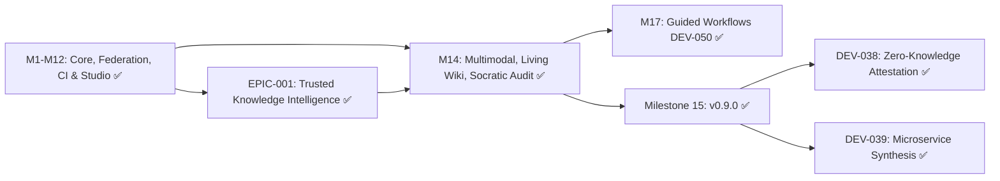

# Agtoosa2 — Master Plan

> **Source of truth for Agtoosa Revision 2 development.**  
> **Architecture:** Unified Graph-Native Engineering Operating System.  
> **Historical Archive:** See [docs/archive/Master-Plan-Archive.md](archive/Master-Plan-Archive.md) for full historical specifications of completed Milestones 1–14, 17, and EPIC-001.

## Project Charter

| Field | Value |
|---|---|
| Product | `Agtoosa2` |
| Repository | `https://github.com/sky2464/Agtoosa2` |
| Version | `0.9.0` (Active Frontier) |
| Core Engine | Python 3.11+ (SQLite FTS5, Zero-Dependency Standard Library) |
| Active Milestone | `v0.9.0` — **Milestone 15 (DEV-038 & DEV-039) Delivered & Shipped (100% Complete)** |
| Foundation Gate | [**EPIC-001 — Trusted Knowledge Intelligence**](specs/epic-001-trusted-knowledge-intelligence.md) (DEV-040–049) — ✅ **CLEARED & VERIFIED (100% Precision)** |
| Delivered Milestones | Milestone 1–12, 14, 15, 17 & EPIC-001 (All 50 Stages Delivered & Verified) |

---

## Active Frontier: Milestone 15 (v0.9.0) — Delivered & Shipped

Milestone 15 establishes Agtoosa2 as an enterprise-grade trust and cross-service synthesis platform:

| Rank | Cycle ID | Title | Rating | Milestone | Status | Strategic Value & Architectural Impact |
|:---:|---|---|:---:|---|:---:|---|
| 🥇 | **DEV-038** | Zero-Knowledge Architecture Cryptographic Attestation | **70 / 100** | Milestone 15 (v0.9.0) | ✅ Done | **Cryptographic Security Proofs**: Produces cryptographically signed architectural attestations verifying compliance with layer boundary invariants without exposing proprietary source code. |
| 🥈 | **DEV-039** | Autonomous Cross-Language Microservice Synthesis | **68 / 100** | Milestone 15 (v0.9.0) | ✅ Done | **Multi-Language Generation**: Generates strongly-typed gRPC (.proto) and OpenAPI client/server adapters directly from federated multi-repo graph models. |

---

### DEV-038: Zero-Knowledge Architecture Cryptographic Attestation

- **Specification**: [docs/specs/spec-DEV-038-zero-knowledge-attestation.md](specs/spec-DEV-038-zero-knowledge-attestation.md)
- **Objective**: Allow teams and vendors to prove architectural compliance (layer boundary invariants, cyclic dependency freedom, dependency tier discipline) to auditors, clients, and CI quality gates without revealing proprietary symbol names, file paths, or source code.
- **Core Capabilities**:
  1. **Salted Blind Symbol Commitments**: Obfuscates symbol identities and file paths ($H(\text{symbol\_id} \parallel \text{salt})$) while binding them to verified architectural tiers (Tier 1 Entrypoint, Tier 2 Application/Engine, Tier 3 Domain Core).
  2. **Merkle Proof of Invariant Compliance**: Computes Merkle tree of compliant dependency edges ($T_a \to T_b$ where tier level $a \le b$) and guarantees zero circular dependencies (Tarjan cycle verification).
  3. **Cryptographically Signed Attestation Envelope**: Packages the Merkle root, tier statistics, blinded violation proofs (if any), and an HMAC-SHA256 signature into an attestation document (`.agtoosa/attestation.json`).
  4. **Zero-Knowledge Verification**: Third-party verifiers validate the digital signature, verify the Merkle root against known hashes, and verify invariant compliance without inspecting or accessing source code.
- **CLI & MCP Tooling**:
  - `agtoosa attest generate [--output <path>] [--key <secret>] [--json]`
  - `agtoosa attest verify <file> [--key <secret>] [--json]`
  - MCP Tools: `agtoosa_generate_attestation`, `agtoosa_verify_attestation`.

---

### DEV-039: Autonomous Cross-Language Microservice Synthesis

- **Specification**: [docs/specs/spec-DEV-039-microservice-synthesis.md](specs/spec-DEV-039-microservice-synthesis.md)
- **Objective**: Transform discovered knowledge graph endpoints, data schemas, and service contracts into strongly-typed gRPC services, OpenAPI specifications, and multi-language client/server boilerplate.
- **Core Capabilities**:
  1. **Graph Endpoint & Schema Extraction**: Gathers discovered API endpoints (`NodeType.FUNCTION` with `rest_endpoint` or `grpc_method`) and schema models (`NodeType.SCHEMA` / ORM models) from the knowledge graph and federated repos.
  2. **Protocol Buffers v3 Synthesis**: Generates clean, production-ready `.proto` definitions with message types, service RPC definitions, and standard options.
  3. **OpenAPI 3.0 / 3.1 Synthesis**: Generates valid OpenAPI definitions with JSON schema definitions, route specifications, response codes, and tags.
  4. **Multi-Language Client & Server Adapters**:
     - **Python**: FastAPI router boilerplate & `httpx` async client SDK.
     - **TypeScript**: Express router handler & typed `fetch` client SDK.
     - **Go**: `net/http` standard library server mux & HTTP client struct.
- **CLI & MCP Tooling**:
  - `agtoosa synthesize microservice [--service <name>] [--target python|typescript|go] [--format proto|openapi|code] [--output <dir>] [--json]`
  - MCP Tool: `agtoosa_synthesize_microservice`.

---

## Executive Summary: Delivered Cycles Archive

All previous milestones and foundation gates have been delivered, verified, and archived in [docs/archive/Master-Plan-Archive.md](archive/Master-Plan-Archive.md).

| Milestone | Cycles | Delivered Capabilities | Verification Fixtures | Archive Link |
|---|---|---|---|:---:|
| **Milestone 1 (v0.2.0-alpha)** | DEV-001, DEV-002 | AST Knowledge Graph Core, SQLite FTS5, Incremental Sync, Path & Impact Queries | `test_parser.py`, `test_store.py`, `test_query.py` | [View Archive](archive/Master-Plan-Archive.md#milestone-1-knowledge-engine-core-v020-alpha) |
| **Milestone 2 (v0.2.0-beta)** | DEV-003, DEV-004 | Lifecycle Integration, Context Compilation (RAG), Native MCP Server | `test_lifecycle.py`, `test_mcp.py` | [View Archive](archive/Master-Plan-Archive.md#milestone-2-lifecycle-integration--agent-context-v020-beta) |
| **Milestone 3 (v0.2.0-rc.2)** | DEV-005–DEV-008 | C4 Visualizer, Polyglot Parsers, Zero-Trust Security Sandbox, Streaming Scale | `test_visualizer.py`, `test_polyglot.py`, `test_security.py` | [View Archive](archive/Master-Plan-Archive.md#milestone-3-production-hardening-scale--breadth-v020-rc2) |
| **Milestone 4 (v0.2.0-GA)** | DEV-009, DEV-010 | Continuous Watcher, Git Hooks, Review Intelligence, Architectural Memory Bank | `test_watcher.py`, `test_intelligence.py` | [View Archive](archive/Master-Plan-Archive.md#milestone-4-operational-intelligence--automation-v020-ga) |
| **Milestone 5 (v0.2.x)** | DEV-011–DEV-014 | CI/CD PR Gate, Standalone Packaging, IDE Extension, Hybrid GraphRAG v2 | `test_ci_gate.py`, `test_extension.py`, `test_hybrid_rag.py` | [View Archive](archive/Master-Plan-Archive.md#milestone-5-ecosystem-packaging--cicd-intelligence-v02x) |
| **Milestone 6 (v0.3.0)** | DEV-015, DEV-016 | Cross-Repo Federation, Contract Bindings, Monorepo Package Boundaries | `test_federation.py`, `test_monorepo.py` | [View Archive](archive/Master-Plan-Archive.md#milestone-6-enterprise-federation--microservices-v030) |
| **Milestone 7 (v0.3.5)** | DEV-017, DEV-018 | OpenTelemetry Heatmap Overlay, Production Blast Radius | `test_telemetry.py`, `test_production_impact.py` | [View Archive](archive/Master-Plan-Archive.md#milestone-7-runtime-observability--dynamic-heatmaps-v035) |
| **Milestone 8 (v0.4.0)** | DEV-019, DEV-020 | Autonomous Cycle Decoupling, Dead Code & Zombie Symbol Pruning | `test_decoupler.py`, `test_dead_code.py` | [View Archive](archive/Master-Plan-Archive.md#milestone-8-autonomous-architecture-refactoring-engine-v040) |
| **Milestone 9 (v0.4.1)** | DEV-021–DEV-024 | Modular Studio Web, AST Patch Engine, Two-Way Studio Actions, Pre-Push Daemon | `test_studio_server.py`, `test_refactor_engine.py`, `test_guard.py` | [View Archive](archive/Master-Plan-Archive.md#milestone-9-autonomous-code-actions--2-way-studio-sync-v041) |
| **Milestone 10 (v0.4.2)** | DEV-025, DEV-026 | Framework DI & Dynamic Routes, Async Message Queue & Event Bus Lineage | `test_framework_semantics.py`, `test_event_lineage.py` | [View Archive](archive/Master-Plan-Archive.md#milestone-10-deep-polyglot-framework-semantics--distributed-event-lineage-v042) |
| **Milestone 11 (v0.5.0)** | DEV-027 | VS Code / Cursor In-Editor Gutter CodeLens & Marketplace Packaging | `test_extension.py` | [View Archive](archive/Master-Plan-Archive.md#milestone-11-real-time-developer-surface--in-editor-codelens-v050) |
| **Milestone 12 (v0.6.0)** | DEV-028–DEV-032 | C4 Architecture-as-Code, PR Review Bot, Distributed Tracing, PR Repair, Benchmarking CI | `test_c4.py`, `test_pr_bot.py`, `test_distributed_traces.py`, `test_pr_repair.py`, `test_benchmark.py` | [View Archive](archive/Master-Plan-Archive.md#milestone-12-cicd-pull-request-governance--deep-lineage-v060) |
| **Foundation Gate (EPIC-001)** | DEV-040–DEV-049 | Trusted Knowledge Intelligence, Scoped Identity, Parity Ledger, Semantic Gateway | `test_parser_capabilities.py`, `test_symbol_resolution.py`, `test_semantic_gateway.py` | [View Archive](archive/Master-Plan-Archive.md#foundation-gate-epic-001--trusted-knowledge-intelligence-dev-040049) |
| **Milestone 14 (v0.7.0)** | DEV-033–DEV-037 | Multimodal Ingestion, Living C4 Wiki, Zero-Trust Extraction, Socratic Audit, Universal Skill | `test_multimodal_drift.py`, `test_living_wiki.py`, `test_semantic_extraction.py`, `test_socratic_audit.py`, `test_universal_skill.py` | [View Archive](archive/Master-Plan-Archive.md#milestone-14-multimodal-ingestion-living-c4-architecture-wiki--verified-knowledge-intelligence-v070--v080) |
| **Milestone 17 (DX-01)** | DEV-050 | Actionable Architecture Hints & Guided Next-Steps Engine | `test_metrics.py`, `spec-DEV-050-actionable-hints-and-guided-workflows.md` | [View Archive](archive/Master-Plan-Archive.md#developer-experience--guidance-milestone-17-dev-050) |

---

## Roadmap Graph

