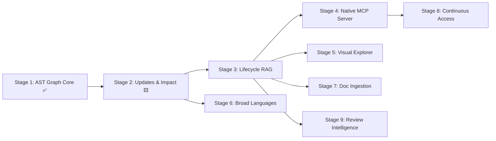

# Agtoosa2 — Master Plan

> **Source of truth for Agtoosa Revision 2 development.**
> **Architecture:** Unified Graph-Native Engineering Operating System.

## Project Charter

| Field | Value |
|---|---|
| Product | `Agtoosa2` |
| Repository | `https://github.com/sky2464/Agtoosa2` |
| Version | `2.0.0-dev` |
| Core Engine | Python 3.11+ (Tree-sitter, SQLite FTS5, NetworkX) |
| Active Cycle | DEV-001 (Stage 1: Core Foundation & AST Graph) |
| Current Milestone | `v2.0.0-alpha.1` |

---

## Active Cycle

| ID | Title | Type | Estimate | Status | Primary Deliverable |
|---|---|---|---|---|---|
| **DEV-001** | Core Foundation & AST Knowledge Graph | Feature | L | ✅ Done | Unified CLI, polyglot AST extractors (Py/JS/TS/Sh), SQLite FTS5 graph store, `/agtoosa graph build/query/status/export` |
| **DEV-002** | Reliable Incremental Updates & Investigation | Feature | M | 🟨 In Progress | Content hash fingerprints, incremental sync, `/agtoosa graph explain/path/impact` |

---

## Strategic Roadmap & Delivery Stages

### Milestone 1: Knowledge Engine Core (v2.0-alpha)
- **DEV-001 (Stage 1) — Core Foundation & AST Knowledge Graph** [✅ Done]
  - Python 3.11+ packaging, zero-service architecture, single `agtoosa` CLI.
  - Parsers for Python, JavaScript/TypeScript, and Shell.
  - SQLite transactional schema + FTS5 full-text indexing.
  - Commands: `agtoosa graph build`, `agtoosa graph query`, `agtoosa graph status`, `agtoosa graph export`.
- **DEV-002 (Stage 2) — Reliable Incremental Updates & Investigation** [⬜ Backlog]
  - Content hash fingerprints, rename and deletion handling.
  - NetworkX directed graph analysis (symbol resolution, call hierarchy).
  - Commands: `agtoosa graph explain <symbol>`, `agtoosa graph path <from> <to>`, `agtoosa graph impact <target>`.

### Milestone 2: Lifecycle Integration & Agent Context (v2.0-beta)
- **DEV-003 (Stage 3) — Graph-Driven Lifecycle & Context Compilation v2** [⬜ Backlog]
  - Ingestion of Story, Criterion, Task, and Test nodes into the knowledge graph.
  - Context RAG v2: Bounded subgraph prompt compilation replacing bloated markdown templates.
  - Lifecycle state machine: `agtoosa spec`, `agtoosa build`, `agtoosa review`, `agtoosa ship`.
  - Mathematical proof graph validation before release.
- **DEV-004 (Stage 4) — Native Model Context Protocol (MCP) Server** [⬜ Backlog]
  - Built-in MCP server (`agtoosa mcp`) providing real-time tools for Cursor, Claude Code, Windsurf, Gemini, and Copilot.
  - Tools: `get_symbol_context`, `query_impact_radius`, `get_active_task_context`, `record_task_evidence`.

### Milestone 3: Visualization & Parity Breadth (v2.0-GA)
- **DEV-005 (Stage 5) — Interactive Architecture Exploration & Visualizer** [⬜ Backlog]
  - Bundled Cytoscape.js standalone offline viewer (`agtoosa graph view`).
  - Community clustering (Louvain / modularity), PageRank importance scoring, cycle detection.
  - Multi-format exports: Markdown wiki, Obsidian vault, SVG, GraphML, Cypher.
- **DEV-006 (Stage 6) — Broad Language & Schema Coverage** [⬜ Backlog]
  - Tree-sitter grammar modules: Go, Rust, C/C++, Java, Kotlin, C#, Ruby, PHP, SQL DDL, Terraform, Dockerfile.
- **DEV-007 (Stage 7) — Document, Schema & Media Ingestion** [⬜ Backlog]
  - Local PDF, Markdown, and Office document parsing with page/heading provenance.
  - Multimodal image and diagram understanding via active assistant context.
- **DEV-008 (Stage 8) — Continuous & Multi-Project Access** [⬜ Backlog]
  - Background filesystem watcher (`agtoosa graph watch`), composable Git hooks (`agtoosa graph hooks`).
  - Multi-worktree and federated cross-project graph queries.
- **DEV-009 (Stage 9) — Review Intelligence & Project Memory** [⬜ Backlog]
  - PR/branch graph diffs (`agtoosa graph prs`), feedback logging (`agtoosa graph remember`), and architectural lessons (`agtoosa graph reflect`).
