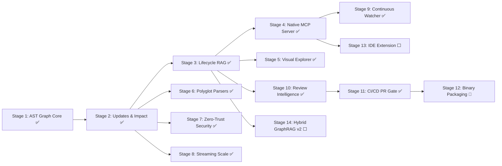

# Agtoosa2 — Master Plan

> **Source of truth for Agtoosa Revision 2 development.**
> **Architecture:** Unified Graph-Native Engineering Operating System.

## Project Charter

| Field | Value |
|---|---|
| Product | `Agtoosa2` |
| Repository | `https://github.com/sky2464/Agtoosa2` |
| Version | `0.2.1-dev` |
| Core Engine | Python 3.11+ (Tree-sitter, SQLite FTS5, NetworkX) |
| Active Cycle | DEV-012 (Stage 12: Standalone Binary Packaging & Multi-Platform Distribution) |
| Current Milestone | `v0.2.x` |

---

## Active Cycle

| ID | Title | Type | Estimate | Status | Primary Deliverable |
|---|---|---|---|---|---|
| **DEV-012** | Standalone Binary Packaging & Multi-Platform Distribution | DevOps | M | 🔄 Ready / Next | Standalone compiled executables, PyPI wheel distribution, Homebrew tap formula |

## Completed Cycles

| ID | Title | Type | Status | Primary Deliverable |
|---|---|---|---|---|
| **DEV-001** | Core Foundation & AST Knowledge Graph | Feature | ✅ Done | Unified CLI, polyglot AST extractors (Py/JS/TS/Sh), SQLite FTS5 graph store, `/agtoosa graph build/query/status/export` |
| **DEV-002** | Reliable Incremental Updates & Investigation | Feature | ✅ Done | Content hash fingerprints, incremental sync, `/agtoosa graph explain/path/impact` |
| **DEV-003** | Graph-Driven Lifecycle & Context Compilation v0.2 | Feature | ✅ Done | Spec/Story/Criteria/Task ingestion, Context Compiler v0.2 (Graph RAG), `review`, and mathematical proof `ship` gates |
| **DEV-004** | Native Model Context Protocol (MCP) Server | Feature | ✅ Done | Built-in stdio/SSE MCP server exposing real-time graph navigation tools to AI coding agents |
| **DEV-005** | Interactive Architecture Exploration & Visualizer | Feature | ✅ Done | Offline Cytoscape.js HTML visualizer (`agtoosa graph view`), architecture health & cycle reports (`agtoosa graph report`), and multi-format exports (Obsidian, GraphML, Cypher, DOT) |
| **DEV-006** | Broad Polyglot Language & Schema Coverage | Feature | ✅ Done | Polyglot parser supporting Go, Rust, Java, Kotlin, C/C++, C#, SQL DDL, and Dockerfile |
| **DEV-007** | Zero-Trust Security Hardening | Security | ✅ Done | Visualizer CSP & anti-XSS serialization; workspace sandboxing & symlink guards; .gitignore enforcement; secret redaction; MCP depth & line clamps; SQLite PRAGMA hardening |
| **DEV-008** | High-Scale Performance & Streaming Optimization | Performance | ✅ Done | O(1) memory chunked streaming (`stream_nodes`, `stream_edges`); in-database recursive SQL CTE for impact traversal; single-pass compound FTS5 queries |
| **DEV-009** | Continuous Watcher & MCP Push | Feature | ✅ Done | Zero-dependency filesystem watcher (`agtoosa graph watch`), Git hooks (`agtoosa graph hooks`), live MCP resource update notifications |
| **DEV-010** | Review Intelligence & Architecture Drift Alarms | Feature | ✅ Done | Layer boundary enforcement, cyclic dependency alarms, blast radius warnings, PR diff analysis (`agtoosa review --diff`), and Architectural Memory Bank (`agtoosa review remember/reflect`) |
| **DEV-011** | CI/CD Quality Gate & GitHub Action Integration | Feature | ✅ Done | Composite GitHub Action (`action.yml`), reference CI workflow, PR architectural impact markdown comment generator, CLI `agtoosa ci review/check` |

---

## Strategic Roadmap & Delivery Stages

### Milestone 1: Knowledge Engine Core (v0.2.0-alpha)
- **DEV-001 (Stage 1) — Core Foundation & AST Knowledge Graph** [✅ Done]
  - Python 3.11+ packaging, zero-service architecture, single `agtoosa` CLI.
  - Parsers for Python, JavaScript/TypeScript, and Shell.
  - SQLite transactional schema + FTS5 full-text indexing.
  - Commands: `agtoosa graph build`, `agtoosa graph query`, `agtoosa graph status`, `agtoosa graph export`.
- **DEV-002 (Stage 2) — Reliable Incremental Updates & Investigation** [✅ Done]
  - Content hash fingerprints, rename and deletion handling.
  - Commands: `agtoosa graph explain <symbol>`, `agtoosa graph path <from> <to>`, `agtoosa graph impact <target>`.

### Milestone 2: Lifecycle Integration & Agent Context (v0.2.0-beta)
- **DEV-003 (Stage 3) — Graph-Driven Lifecycle & Context Compilation v0.2** [✅ Done]
  - Ingestion of Story, Criterion, Task, and Test nodes into the knowledge graph.
  - Context RAG v0.2: Bounded subgraph prompt compilation replacing bloated markdown templates.
  - Lifecycle state machine: `agtoosa review` and mathematical proof graph validation on `agtoosa ship`.
- **DEV-004 (Stage 4) — Native Model Context Protocol (MCP) Server** [✅ Done]
  - Built-in MCP server (`agtoosa mcp`) providing real-time tools for Cursor, Claude Code, Windsurf, Gemini, and Copilot.
  - Tools: `get_symbol_context`, `query_impact_radius`, `get_active_task_context`, `record_task_evidence`, `agtoosa_watch_status`.

### Milestone 3: Production Hardening, Scale & Breadth (v0.2.0-rc.2)
- **DEV-005 (Stage 5) — Interactive Architecture Exploration & Visualizer** [✅ Done]
  - Bundled standalone offline viewer (`agtoosa graph view`).
  - Community clustering, PageRank importance scoring, cycle detection, health scorecard (`agtoosa graph report`).
  - Multi-format exports: Markdown wiki / Obsidian vault, GraphML, Cypher, DOT.
- **DEV-006 (Stage 6) — Broad Polyglot Language & Schema Coverage** [✅ Done]
  - Polyglot parser supporting Go, Rust, Java, Kotlin, C/C++, C#, SQL DDL tables & views, and Dockerfiles.
- **DEV-007 (Stage 7) — Zero-Trust Security Hardening** [✅ Done]
  - Strict Content-Security-Policy & anti-XSS HTML escaping in visualizer.
  - Workspace scanner sandboxing, canonical path boundary checks, and symlink escape defenses.
  - Automated regex secret and private key redaction in nodes and docstrings.
  - .gitignore pattern loading and enforcement during workspace scans.
  - MCP JSON-RPC protocol max depth and line byte clamping.
- **DEV-008 (Stage 8) — High-Scale Performance & Streaming Optimization** [✅ Done]
  - O(1) memory footprint chunked generators (`stream_nodes`, `stream_edges`).
  - In-database SQLite `WITH RECURSIVE` CTE for blast radius calculations (`compute_impact`).
  - Single-pass compound boolean FTS5 query optimization in Context Compiler.

### Milestone 4: Operational Intelligence & Automation (v0.2.0-GA)
- **DEV-009 (Stage 9) — Continuous Watcher & MCP Push Notifications** [✅ Done]
  - Background filesystem watcher (`agtoosa graph watch`), incremental sync on save with debouncing.
  - Automated Git hook management (`agtoosa graph hooks install/remove/status`).
  - Real-time MCP resource notifications (`notifications/resources/updated`) for connected AI assistants.
- **DEV-010 (Stage 10) — Review Intelligence & Architecture Drift Alarms** [✅ Done]
  - Architectural tier hierarchy enforcement (Tier 1 Entrypoints -> Tier 2 Application/Engine -> Tier 3 Domain Core).
  - Cyclic dependency alarms and high blast radius warnings.
  - Git PR line-level diff to graph symbol mapping (`agtoosa review --diff <base-ref>`).
  - Institutional Architectural Memory Bank (`agtoosa review remember/reflect`) with automatic prompt injection.

### Milestone 5: Ecosystem, Packaging & CI/CD Intelligence (v0.2.x)
- **DEV-011 (Stage 11) — CI/CD Quality Gate & GitHub Action Integration** [✅ Done]
  - Composite GitHub Action (`action.yml`) running `agtoosa review --diff origin/main --strict`.
  - Automated rich PR architectural impact markdown comment generator.
  - Merge blocking on circular dependencies or layer boundary regressions.
- **DEV-012 (Stage 12) — Standalone Binary Packaging & Distribution** [🔄 Next Up]
  - Standalone compiled executables (macOS Apple Silicon/Intel, Linux x86_64, Windows x64).
  - Automated GitHub Releases matrix, Homebrew tap formula, PyPI publication.
- **DEV-013 (Stage 13) — VS Code & Cursor IDE Extension** [⬜ Backlog]
  - In-editor architecture tree view, caller/callee inspection, code lens annotations, and real-time blast radius alerts.
- **DEV-014 (Stage 14) — Hybrid GraphRAG v2 & Semantic Vector Search** [⬜ Backlog]
  - Embedded zero-service ONNX vector embeddings, cosine similarity + FTS5 + graph CTE hybrid prompt compiler.
