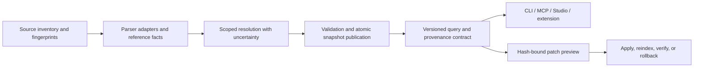

# Epic EPIC-001: Trusted Knowledge Intelligence

**Status:** ✅ Cleared & Verified (100% precision gate passed; DEV-040–DEV-049 delivered).  
**Decision record:** User approved the direction and selected accuracy before breadth, all current languages, and local-first/optional-cloud AI. On 2026-09-13 the user requested that this be recorded in the latest Master Plan as a future epic before implementation.  
**Planning baseline:** `8fd913a009db1209b84498aef72bc3fea75b4b76`.  
**Research:** [Graphify parity and graph trust](../research/2026-09-13-graphify-parity-and-trust.md).  
**Parent roadmap:** [Master Plan](../Master-Plan.md).  
**New child stories:** DEV-040–049. Existing DEV-033–039 retain their identifiers. Numeric IDs are identifiers, not execution order.

**Amendment 2026-09-14:** DEV-047–049 were added from a second parity audit against the same Graphify reference, recording findings R-12–14. That audit independently reproduced R-01 and raised no correction to R-01–11. Two candidate cycles it proposed were dropped as duplicates before filing: a tree-sitter parser backend (already DEV-040) and a retrieval-quality benchmark harness (already DEV-045/046). A third proposal — a numeric `confidence` column on every edge — was rejected as contradicting DEV-043's contract semantics, which require classified evidence and separately classified resolution status rather than an unexplained scalar.

## 1. Goal contract

Developers and AI coding agents must be able to inspect code relationships, determine their evidential support, and distinguish unknown results from verified facts before making changes. The first milestone delivers a reliable shared foundation across all currently supported languages. Later milestones extend content coverage and intelligence only after this gate.

Success means accurate scoped identities, explicit ambiguity, atomic reproducible updates, preserved manual evidence, consistent machine results, and repair/benchmark outcomes that cannot misrepresent missing verification as success. A larger feature count, a passing legacy suite, and an attractive visualization do not establish this goal.

The release includes Python, JS/TS and existing module/JSX/TSX variants, Shell/Bash/Zsh, Go, Rust, Java/Kotlin, C/C++, C#, SQL, Dockerfile, and Prisma. Every family needs labelled test cases and capability reporting. Unsupported constructs remain visible limitations, not silently fabricated edges.

## 2. Global constraints and architecture

- Python 3.11+, SQLite/FTS5, dependency-free core, optional integrations, existing CLI/MCP/Studio/editor surfaces.
- Retain Python `ast`; introduce optional grammar-backed adapters and first-party language-specific resolution. Validate grammar availability/version compatibility before advertising support. A missing grammar leaves the core usable with explicit limited coverage.
- Code extraction stays offline. Later semantic enrichment uses the active assistant or explicit provider configuration; no automatic cloud fallback. Indexed documents and model output are data, never instructions or approval evidence.
- Keep Graphify outside the production dependency graph. Compare it in an isolated evaluation environment using pinned inputs and budgets.
- Preserve workspace boundaries, ignores, secret redaction, and user-owned configuration. Generated graph state remains local and rebuildable; manually recorded lifecycle/evidence state must survive.
- Evolve the existing engine; do not create a replacement app or move it into the legacy generator's template directory.

Proposed flow:

Parser adapters own syntax facts and locations. Resolution owns identities and candidate sets. Storage owns snapshot publication and record ownership. Query services own shared envelopes; consumers render them without independently resolving symbols. Repair services consume a specific snapshot and source hashes. Semantic knowledge may link to formal evidence but cannot create test passes or approve lifecycle transitions.

## 3. Child stories and detailed backlog

Each child receives a canonical `spec-DEV-<id>-*.md` before code work, using the repository's specification conventions. The epic supplies cross-cutting requirements; child specs must define exact grammar packages, migration SQL, wire schemas, and platform adapters before implementing those components. Future story files and tests named below are proposed deliverables, not existing evidence.

### DEV-040 — Parser coverage and language adapters

**Addresses:** R-01. **Dependencies:** none. **Acceptance:** AC-01–03.

- [x] Inventory recognized suffixes, dialects, available parser versions, and actual extracted relationship types; publish a capability registry.
- [x] Define a common parse result containing nodes, unbound references, source spans, parser/version, coverage, diagnostics, and source hashes.
- [x] Retain Python AST; add grammar-backed implementations and compatible optional installation extras for the other families. Preserve explicitly labelled limited fallback behavior.
- [x] Test comments/strings that resemble code, nested declarations, multiline syntax, overloads, malformed inputs, missing grammars, and unsupported dynamic constructs for each family.
- [x] Include route/DI/event/schema extractors in capability reporting so a grammar upgrade cannot silently drop current downstream relationships.

**Touchpoints:** `agtoosa/parser/`, `pyproject.toml`, distribution scripts; existing parser/polyglot/framework/event tests plus proposed `tests/test_parser_capabilities.py` and language fixtures.

### DEV-041 — Scoped identity and honest resolution

**Addresses:** R-02/03/05. **Dependencies:** DEV-040. **Acceptance:** AC-04–06.

- [x] Define identities from repository/module/package/lexical scope and signatures where applicable. Keep equal labels as distinct entities.
- [x] Implement import/export alias and qualified-name binding for each family using the reference facts from DEV-040.
- [x] Preserve original reference facts independently of resolved edges; support unique resolution, multiple candidates, and unresolved references without overwriting provenance.
- [x] Make exact IDs authoritative; return disambiguation for non-unique names and search suggestions without promoting the top hit into an action target.
- [x] Test external modules, same-name symbols in different files/classes, relative imports, overloads, shadowing, and unknown runtime dispatch.

**Touchpoints:** `agtoosa/parser/__init__.py`, a focused resolver module, `agtoosa/graph/query.py`, domain models; proposed `tests/test_symbol_resolution.py` and expanded query tests.

### DEV-042 — Atomic snapshots, incremental equivalence, and preservation

**Addresses:** R-04/05/06. **Dependencies:** DEV-040/041. **Acceptance:** AC-07–10.

- [x] Classify record ownership as derived extraction, manual lifecycle/evidence, and other retained integrations; specify retention and invalidation for each.
- [x] Add a versioned migration with a recoverable database backup; validate schema/integrity before activation and restore on failure. Never blindly clear manual records.
- [x] Stage extraction and resolution, then commit nodes, edges, reference facts, fingerprints, diagnostics, and snapshot metadata together.
- [x] Invalidate by source content, parser/configuration version, and workspace state; recompute references from unchanged callers when targets change.
- [x] Detect source changes during indexing; keep the previous valid snapshot and expose stale/failed status instead of publishing mismatched hashes.
- [x] Test clean versus incremental equality after add/edit/delete/rename/branch-switch and parser/config upgrades, failed publication, retry, no-op builds, and concurrent readers.

**Touchpoints:** parser orchestration, `agtoosa/graph/store.py`, watcher/hooks; proposed `tests/test_snapshot_integrity.py` and `tests/test_graph_migrations.py`.

### DEV-043 — Versioned explainable interfaces

**Addresses:** R-03/08. **Dependencies:** DEV-040–042. **Acceptance:** AC-11–13.

- [x] Define a shared machine-result envelope with contract version, snapshot ID, freshness, coverage, citations, diagnostics, and resolution status/candidates.
- [x] Preserve existing commands and unambiguous behavior; define explicit opt-in/version negotiation for changed JSON shapes and document legacy-output limitations.
- [x] Add `agtoosa graph capabilities` for installed parser coverage and `agtoosa graph verify` for graph/source integrity; report failures through machine-readable status and nonzero verification exit codes.
- [x] Reuse the contract in explain/path/impact, context compilation, MCP, Studio REST and the extension; display stale/incomplete/ambiguous outcomes rather than a false all-clear state.
- [x] Describe existing hash/n-gram retrieval accurately. Keep learned semantic retrieval as a separate optional future capability.

**Minimum contract semantics:** classify evidence as extracted/inferred/manual; classify reference resolution separately as resolved/ambiguous/unresolved. Citations bind file/span/content hash to a snapshot. Freshness and completeness are distinct fields. Do not encode uncertainty solely as an unexplained numeric confidence score.

**Touchpoints:** `agtoosa/core/model.py`, query/context/CLI/MCP/Studio and `extension/extension.js`; proposed contract schema/fixtures and `tests/test_graph_contract.py`, plus existing consumer tests.

### DEV-044 — Verified repair and conservative dead-code actions

**Addresses:** R-10 and downstream R-01–06. **Dependencies:** DEV-043. **Acceptance:** AC-14–16.

- [x] Keep zero-caller/low-coverage symbols as review candidates. Account for public entrypoints, dynamic dispatch, incomplete language coverage, and external users before permitting deletion.
- [x] Bind every patch to the snapshot and hashes of all affected sources; reject stale or ambiguous plans before touching any file.
- [x] Treat dry runs as previews with `verified: false`; failed apply outcomes cannot be marked applied.
- [x] Reindex after applying, verify the specific original issue and absence of new violations, run explicitly configured relevant project checks, and record their commands/results.
- [x] Missing required checks or failed checks prevent verified status and automatic commits. Roll back the complete patch on failure, then reconcile graph state with restored source.
- [x] Test stale source, partial write failure, syntax/test failure, unchanged original finding, new regression, rollback failure reporting, and preservation of unrelated user changes.

**Touchpoints:** refactor/dead-code/repair engines, guard and Studio action endpoints; expanded existing tests and proposed `tests/test_repair_verification.py`.

### DEV-045 — Real benchmark evidence

**Addresses:** R-09. **Dependencies:** DEV-043. **Acceptance:** AC-17/18.

- [x] Replace synthetic fallback measurements with unsupported/skipped results carrying a reason. Distinguish execution errors from skips and successful measurements.
- [x] Require explicit callable adapters/fixtures and arguments; execute target code in a controlled subprocess with timeouts and bounded resources where supported.
- [x] Identify workload, inputs, environment, iterations, warmups, and comparable baseline. Do not silently equate production telemetry with a local microbenchmark.
- [x] Propagate measured/skipped/unsupported/failed counts through CLI, MCP, baseline storage, regression analysis and CI. A skipped target cannot become a passing regression check or seed a measured baseline.
- [x] Test missing imports, required arguments, unsupported languages, exceptions, timeouts and valid real workloads.

**Touchpoints:** `agtoosa/benchmark/`, observability CLI and MCP results; expanded `tests/test_benchmark.py` and proposed evidence-contract tests.

### DEV-046 — Held-out evaluation, parity ledger, and release gate

**Addresses:** R-01–11. **Dependencies:** DEV-040–045 for release acceptance; fixtures can be prepared first. **Acceptance:** AC-19–21.

- [x] Implement the evaluation protocol in the linked research report: independent labels, separate development/held-out splits, all current families, pinned source manifests, matched budgets and raw samples.
- [x] Measure edge precision/recall, ambiguity handling, retrieval/answer/citation quality, context size, cold/warm/index-update/query latency and peak memory.
- [x] Record reproducible Graphify comparisons in an isolated environment; never depend on Graphify in the shipped engine or copy its extraction implementation.
- [x] Publish capabilities with implemented/limited/planned/verified states and links to real acceptance evidence; correct package/roadmap version mismatches without declaring an unverified release.
- [x] Run complete core and optional-parser suites, migration tests, cross-surface contracts, relevant architecture CI checks, and clean install/package checks. Capture Studio/extension evidence for changed UI states.
- [x] Open the next milestone only when the correctness gate passes; explicitly report unsupported scope and regressions rather than using average scores to hide them.

**Touchpoints:** proposed `tests/fixtures/trusted_graph/`, `scripts/evaluate_graph_quality.py`, evaluation manifests/reports, docs and CI. Evaluation data must carry redistribution permission and exclude private repositories/secrets.

### DEV-047 — Source rationale and decision provenance

**Addresses:** R-12. **Dependencies:** DEV-040/041. **Acceptance:** AC-22/23.

- [x] Recognize `WHY:`, `NOTE:`, `HACK:`, and `ASSUMPTION:` markers in each family's comment syntax, using the parser adapters from DEV-040 rather than a separate text scan.
- [x] Bind each rationale to its enclosing symbol through the scoped identity from DEV-041; an unbindable rationale stays attached to its file span rather than being guessed onto a nearby symbol.
- [x] Record file, span, and content hash as citations so rationale participates in the DEV-043 envelope and survives DEV-042 snapshot publication.
- [x] Link rationale to lifecycle records when it cites an ADR or story identifier; an unresolvable citation is reported as unresolved, never silently dropped.
- [x] Include rationale in compiled context packs within the existing budget rules, and apply secret redaction before it reaches any pack, MCP response, or Studio surface.
- [x] Test each comment syntax, markers inside strings and nested comments, rationale on overloaded and shadowed names, unbindable spans, and redaction of credential-shaped text.

**Touchpoints:** `agtoosa/parser/`, `agtoosa/core/model.py`, `agtoosa/core/context_compiler.py`, `agtoosa/core/security.py`; proposed `tests/test_rationale.py`.

### DEV-048 — Community detection correctness across install profiles

**Addresses:** R-13. **Dependencies:** DEV-042. **Acceptance:** AC-24/25.

- [x] Move community detection out of `_detect_communities` into a dedicated module with one documented algorithm contract.
- [x] Implement a first-party modularity optimizer in the dependency-free core so the minimal install and the optional-dependency install answer the same question.
- [x] Remove the union-find connected-components path. Reachability may still be reported, but never under the name "community".
- [x] Make partitions deterministic for a given snapshot and seed; report the modularity score and the algorithm actually used alongside every partition.
- [x] Report unavailable rather than invented structure when a graph is too small or too sparse to partition meaningfully.
- [x] Test modularity against labelled ground-truth partitions, seed stability, minimal-install equivalence, disconnected graphs, and single-component graphs.

**Touchpoints:** `agtoosa/graph/metrics.py`, a dedicated community module, `agtoosa graph report`; proposed `tests/test_communities.py`. Consumed by follow-on DEV-034 hierarchy work, which must not assume this story's output is hierarchical.

### DEV-049 — Semantic provider gateway and egress boundary

**Addresses:** R-14. **Dependencies:** DEV-043; precedes any semantic consumer. **Acceptance:** AC-26/27.

- [x] Define one gateway that every semantic consumer uses. DEV-033/035/036 must not implement provider handling, redaction, budgets, or caching independently.
- [x] Support the active assistant and explicitly configured local or cloud providers. No automatic cloud fallback, and no network call without recorded opt-in.
- [x] Apply workspace boundary checks and secret redaction before transmission; assert redaction on the serialized request, not on caller intent.
- [x] Enforce a token and cost ceiling per pass with a preview mode that estimates and transmits nothing. Exceeding a budget yields a partial, clearly-labelled result rather than a truncated write.
- [x] Key the response cache on content hash plus provider, model, and prompt version, per the DEV-035 requirement in the research report's §7.
- [x] Treat all provider output as data: it can link to evidence but cannot create test passes, approve lifecycle transitions, or resolve symbols that DEV-041 left ambiguous.
- [x] Test the offline no-op path with a socket-level assertion, redaction on the wire, budget refusal, cache key sensitivity to model and prompt version, and provider unavailability.

**Touchpoints:** proposed `agtoosa/semantic/`, `agtoosa/core/security.py`, CLI and MCP surfaces; proposed `tests/test_semantic_gateway.py`. Concrete provider APIs, model identifiers, and cost tables must be taken from current provider reference documentation at specification time, never written from memory.

## 4. Acceptance and evidence map

Evidence slots below are planned. None is currently satisfied by this epic's publication.

| Criterion | Required behavior | Owner | Planned evidence |
|---|---|---|---|
| AC-01 | Every current family has an explicit parser/version/coverage entry and representative fixtures. | DEV-040 | Capability report and per-family fixture matrix. |
| AC-02 | Missing optional components leave the dependency-free core usable and visibly limited. | DEV-040 | Minimal-install and missing-grammar tests. |
| AC-03 | Malformed/dynamic/unsupported inputs expose diagnostics without invented certainty. | DEV-040 | Negative parse and dynamic-reference fixtures. |
| AC-04 | Duplicate labels remain separate; imports, scopes and aliases determine valid binding. | DEV-041 | Gold symbol/reference assertions across languages. |
| AC-05 | Ambiguous queries return candidates; actions refuse guessed targets. | DEV-041 | Query/CLI/MCP/action ambiguity tests. |
| AC-06 | Original references survive resolution and can be recomputed. | DEV-041 | Target change, ambiguity change and external-reference tests. |
| AC-07 | A failed index publication exposes either the old complete snapshot or the new complete snapshot, never a partial one. | DEV-042 | Fault injection and concurrent-reader tests. |
| AC-08 | Normalized clean/incremental graphs match for all declared mutation sequences. | DEV-042 | Snapshot equivalence suite. |
| AC-09 | Backed-up migrations and clean rebuilds preserve manual lifecycle/evidence records. | DEV-042 | Schema migration, restore and retention assertions. |
| AC-10 | Source/parser/config changes invalidate affected data; source changes during indexing cannot be marked current. | DEV-042 | Freshness, retry and parser-upgrade tests. |
| AC-11 | All consuming surfaces return/render the same snapshot, coverage and uncertainty semantics. | DEV-043 | Shared contract fixtures and UI evidence. |
| AC-12 | Capabilities reflect installed components; verify detects integrity/source mismatches without fabricating freshness. | DEV-043 | CLI integration and corrupt/stale snapshot tests. |
| AC-13 | Legacy command compatibility and explicit machine-version behavior are documented and tested. | DEV-043 | Compatibility fixtures and release notes. |
| AC-14 | Uncertain dead code stays a candidate; stale/ambiguous patches perform no mutation. | DEV-044 | Hash mismatch and incomplete-coverage action tests. |
| AC-15 | Preview is unverified; verified repair includes fresh graph, issue-specific result and passing required checks. | DEV-044 | Preview/apply/check evidence assertions. |
| AC-16 | Failed repairs restore source and reconcile graph; rollback failures are explicit. | DEV-044 | Partial-apply, failed-test and restore tests. |
| AC-17 | Unmeasurable workloads are not replaced with synthetic application results. | DEV-045 | Unsupported/skip/error result tests. |
| AC-18 | Only comparable real measurements seed baselines and determine regression success. | DEV-045 | Baseline, subprocess and CI tests. |
| AC-19 | Every current family has a held-out evaluation with denominators and raw outputs. | DEV-046 | Versioned corpus/run manifests and reports. |
| AC-20 | Comparative claims identify pinned inputs, identical budgets, metrics and limitations. | DEV-046 | Paired evaluation report and claim-to-evidence ledger. |
| AC-21 | Source citations, task links and status/version claims resolve to actual artifacts. | DEV-046 | Documentation/architecture CI and acceptance review. |
| AC-22 | Rationale binds to the correct scoped symbol or stays at file span; it is never guessed onto a neighbour. | DEV-047 | Per-language marker fixtures including overloads, shadowing and unbindable spans. |
| AC-23 | Rationale carries citations, survives snapshot publication, and is redacted before leaving the store. | DEV-047 | Citation binding, snapshot round-trip and redaction tests. |
| AC-24 | Minimal and optional-dependency installs produce the same partition semantics and report the algorithm used. | DEV-048 | Install-profile equivalence and algorithm-reporting tests. |
| AC-25 | Partitions are deterministic per snapshot/seed; insufficient structure reports unavailable rather than invented groups. | DEV-048 | Ground-truth modularity, seed stability and sparse/disconnected graph tests. |
| AC-26 | No semantic network call occurs without recorded opt-in; redaction is proven on the serialized request. | DEV-049 | Socket-level offline assertion and on-the-wire redaction tests. |
| AC-27 | Budgets refuse rather than truncate, and cache keys change with provider, model and prompt version. | DEV-049 | Budget refusal and cache-key sensitivity tests. |

## 5. Sequencing and later development

**Foundation order:** define evaluation fixtures → DEV-040 → DEV-041 → DEV-042 → DEV-043 → DEV-044 and DEV-045 → DEV-046 acceptance. DEV-044 and DEV-045 are independent after their shared interface; this is a dependency statement, not an instruction to launch agents now.

**Amendment stories:** DEV-047 follows DEV-041 and rides the same parser and identity work. DEV-048 follows DEV-042 and is otherwise independent of the foundation chain. DEV-049 follows DEV-043 and must land before any semantic consumer, so it gates the follow-on rows below rather than the foundation gate. AC-22–25 join the foundation gate; AC-26/27 are required only when the first semantic consumer ships.

**Foundation gate:** all AC-01–25 have evidence; every designated ambiguous-case fixture has zero wrong concrete resolutions; publication, migration, stale-patch and rollback regressions pass; citation bindings validate. Precision/recall and performance are reported by language and workload. No unsupported numerical improvement target is assumed.

| Follow-on work | Existing stories | Required extension and release boundary |
|---|---|---|
| Complete knowledge ingestion | DEV-033 with DEV-035, gated by DEV-049 | General Markdown/sections/rationale, manifests/configs/schemas first; then optional PDF/Office, images, audio/video and URL adapters. Document rationale extends DEV-047's source-comment rationale and must reuse its citation binding. Preserve citations and size/privacy/provider controls; all provider access goes through the DEV-049 gateway. More languages follow the same capability/evaluation contract. |
| Evidence-backed investigation | DEV-035/036/037 | Answer why/impact/change questions with supporting paths, contradictions and missing evidence; evaluate learned semantic retrieval separately from current hashed features. |
| Continuous understanding and living wiki | DEV-034/037, building on DEV-048 | Snapshot-bound wiki/community/report refresh, automatic host-specific consultation and source fallback, context budgets that preserve provenance. Hierarchical partitioning extends DEV-048's flat contract; it may not assume that story's output is already hierarchical. |
| Verified engineering assistance | DEV-036 plus DEV-044 | Combine code/spec/test/history/runtime evidence for proposed changes and relevant checks; previews first, application only through verified repair semantics. |
| Deferred research | DEV-038/039 | Attestation/synthesis require foundation and repair gates. Define what signing proves; a zero-knowledge claim needs its own protocol and validation. |

Every follow-on story needs its own reviewed specification after the foundation gate. Existing version labels are roadmap targets; actual release numbering follows acceptance and package reconciliation.

## 6. Planning completion and implementation boundary

This epic, its research report, and the linked Master Plan/capability/architecture updates satisfy the requested planning record. They do not mark runtime functionality implemented, verified, or released. Implementation remains future work under the latest user instruction.

Before implementation, refine each child specification with concrete API/schema/migration/dependency decisions and the mapped failing regression tests. Preserve the accepted goal and ordering when making those decisions; any change to all-language coverage or local-first behavior requires a new product decision.
