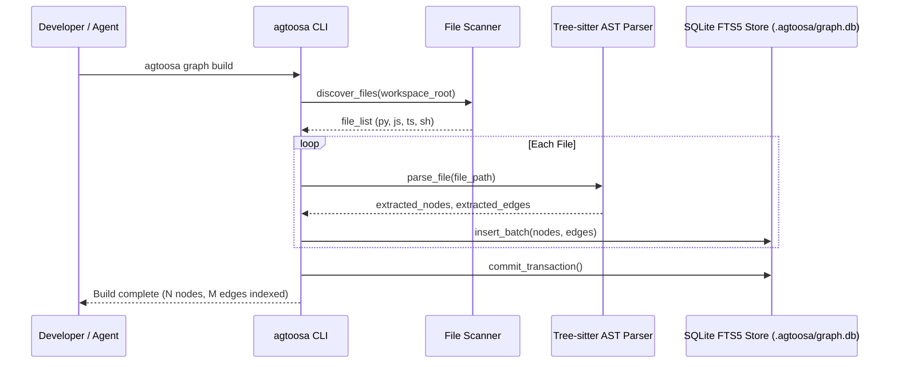

# Spec: DEV-001 — Core Foundation & AST Knowledge Graph

> **Story ID:** DEV-001  
> **Epic:** Native Knowledge Engine — Architecture & Runtime  
> **Status:** 🟨 In Progress  
> **Estimate:** L  
> **Clarity:** `ready`  
> **Spec created:** 2026-09-09  

---

### Plan-Mode Spec Interview (findings)

#### Inferred (≥80% — no question asked)
| Checklist area | Finding |
|---|---|
| Runtime | Python 3.11+ standalone package under `agtoosa/` with CLI executable in `bin/agtoosa`. |
| Storage | SQLite local file at `.agtoosa/graph.db` with FTS5 search. |
| AST Engine | Tree-sitter parsers for core languages (Python, JavaScript/TypeScript, Shell). |
| Command Interface | `agtoosa graph build`, `agtoosa graph query`, `agtoosa graph status`, `agtoosa graph export`. |

#### Asked & confirmed
| Q# | Question | Answer |
|---|---|---|
| Q1 | Clean slate vs. legacy migration | Re-architect as Agtoosa Revision 2: clean slate, minimal and modern, no legacy v1 bloat. |
| Q2 | Scope prioritization | Focus strictly on core functions: AST extraction, transactional graph storage, and query CLI. |

#### Documented assumptions
- Python 3.11+ is available in the user environment or installed via virtualenv.
- Missing dependencies or unindexed projects will degrade gracefully with informative terminal messages.

---

## 1. Requirements

### Goal Contract
The goal of DEV-001 is to establish the core knowledge engine foundation in Agtoosa2. Developers and AI coding agents can run `agtoosa graph build` to deterministically parse repository files into a unified SQLite knowledge graph, inspect graph status with `agtoosa graph status`, search nodes with `agtoosa graph query "<query>"`, and export the graph to standard JSON via `agtoosa graph export`.

### User Stories
- **US-1**: As a developer or agent, I want to index my codebase using `agtoosa graph build` so that code symbols, definitions, and import relationships are persisted in a fast local graph.
- **US-2**: As an AI coding agent, I want to query the graph using `agtoosa graph query` so that I can discover symbols and relationships without grep or brute-force scanning.
- **US-3**: As a maintainer, I want to check graph health, node counts, and storage status using `agtoosa graph status` to verify indexing integrity.

### EARS Acceptance Criteria
- **AC-1 (Ubiquitous)**: The engine SHALL store all node, edge, and attribute data transactionally inside `.agtoosa/graph.db`.
- **AC-2 (Event-Driven)**: WHEN `agtoosa graph build` is executed, the engine SHALL scan repository files, parse code ASTs using Tree-sitter (or standard AST fallback), and insert symbol and relationship records into the SQLite store.
- **AC-3 (Event-Driven)**: WHEN `agtoosa graph query "<search>"` is invoked, the engine SHALL perform an FTS5 full-text match across indexed nodes and return ranked matches with file and line provenance.
- **AC-4 (State-Driven)**: WHILE the repository has not been indexed, `agtoosa graph status` SHALL report uninitialized status with instructions to run `agtoosa graph build`.
- **AC-5 (Unwanted Behavior)**: IF a file contains syntax errors or unsupported formats, THEN the parser SHALL record a parse warning and continue indexing remaining files without crashing.

---

## 2. Architecture & Design

### Component Interaction

### STRIDE Threat Analysis
| Threat | Mitigation |
|---|---|
| **Tampering** | All database writes happen within atomic SQLite transactions; schema version is strictly checked. |
| **Information Disclosure** | `.gitignore`, `.env`, secret files, and private keys (`.pem`, `.key`) are excluded by default in scanner rules. |
| **Denial of Service** | File size limits (default: max 2MB per source file) and parse timeouts prevent hanging on giant generated files. |

---

## 3. Tasks & Dependency Waves

### Wave 1: Foundation & Store
- [x] **Task 1.1**: Define Python package configuration (`pyproject.toml`) and base directory layout.
- [ ] **Task 1.2**: Implement `agtoosa/core/model.py` with `Node`, `Edge`, and entity dataclasses.
- [ ] **Task 1.3**: Implement `agtoosa/graph/store.py` with SQLite schema creation, FTS5 virtual table, and batch inserts.

### Wave 2: AST Parsers & Scanner
- [ ] **Task 2.1**: Implement file scanner with ignore rules (`.git`, `node_modules`, `venv`, hidden files).
- [ ] **Task 2.2**: Implement AST extractor for Python (functions, classes, imports, docstrings).
- [ ] **Task 2.3**: Implement AST extractor for JavaScript/TypeScript and Shell scripts.

### Wave 3: CLI Interface & Verification
- [ ] **Task 3.1**: Implement unified CLI in `agtoosa/cli/main.py` and `bin/agtoosa`.
- [ ] **Task 3.2**: Implement commands: `build`, `status`, `query`, and `export`.
- [ ] **Task 3.3**: Write automated tests in `tests/` and verify end-to-end execution.

---

## Approval Marker
- Status: 🟨 Approved during plan phase; implementation underway.
