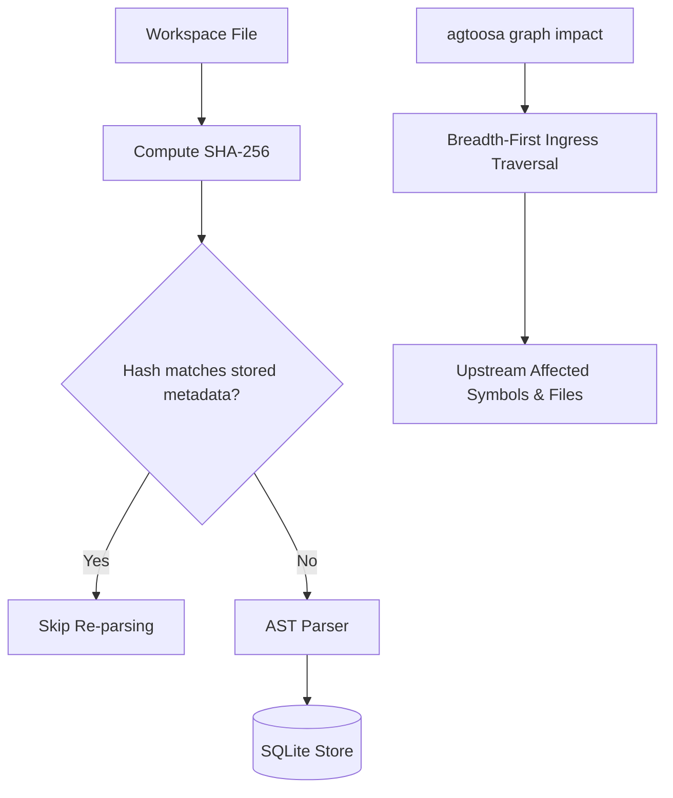

# Spec: DEV-002 — Reliable Incremental Updates & Investigation

> **Story ID:** DEV-002  
> **Epic:** Native Knowledge Engine — Architecture & Runtime  
> **Status:** 🟨 In Progress  
> **Estimate:** M  
> **Clarity:** `ready`  
> **Spec created:** 2026-09-09  

---

### Plan-Mode Spec Interview (findings)

#### Inferred (≥80% — no question asked)
| Checklist area | Finding |
|---|---|
| Incremental Caching | SHA-256 fingerprinting of files; unchanged files skip re-parsing on `agtoosa graph build`. |
| Deletion Handling | When a file is removed from workspace, its nodes, edges, and FTS entries are purged atomically. |
| Investigation Commands | `agtoosa graph explain`, `agtoosa graph path`, `agtoosa graph impact`. |

#### Asked & confirmed
| Q# | Question | Answer |
|---|---|---|
| Q1 | Core investigation tools | Support entity deep-dive (`explain`), connection tracing (`path`), and blast-radius analysis (`impact`). |

---

## 1. Requirements

### Goal Contract
DEV-002 provides fast incremental updates (re-indexing only modified or added files) and equips developers and AI coding agents with high-precision graph investigation tools (`explain`, `path`, `impact`) to navigate codebases and assess change blast radiuses before modifying code.

### User Stories
- **US-1**: As a developer, I want `agtoosa graph build` to only re-parse files that changed since the last build so that indexing in large repositories is near-instantaneous.
- **US-2**: As an AI agent, I want `agtoosa graph explain <symbol>` to describe a symbol, its signature, docstring, callers, and callees in one command.
- **US-3**: As an architect, I want `agtoosa graph path <from> <to>` to trace directed paths between two symbols or files to understand coupling.
- **US-4**: As an engineer modifying a function, I want `agtoosa graph impact <symbol>` to identify every upstream caller and downstream dependency that could be affected.

### EARS Acceptance Criteria
- **AC-1 (Incremental Correctness)**: WHEN `agtoosa graph build` is run without `--clean`, the engine SHALL compute SHA-256 hashes of scanned files and only re-parse modified or newly added files.
- **AC-2 (Deletion Handling)**: WHEN a previously indexed file no longer exists in the workspace, the engine SHALL remove its nodes and cascading edges from `.agtoosa/graph.db`.
- **AC-3 (Investigation: Explain)**: WHEN `agtoosa graph explain "<target>"` is invoked, the engine SHALL return the node's definition, docstring, source location, incoming callers/importers, and outgoing callees/imports.
- **AC-4 (Investigation: Path)**: WHEN `agtoosa graph path "<from>" "<to>"` is invoked, the engine SHALL compute and display the shortest directed path connecting the two entities.
- **AC-5 (Investigation: Impact)**: WHEN `agtoosa graph impact "<target>"` is invoked, the engine SHALL traverse all incoming dependency and call edges to produce an upstream blast-radius report.

---

## 2. Architecture & Design

### Data Flow for Incremental Indexing & Impact

---

## 3. Tasks & Dependency Waves

### Wave 1: Incremental Caching & Deletion Sync
- [x] **Task 1.1**: Add `file_fingerprints` table to store file paths, SHA-256 hashes, and modification times.
- [x] **Task 1.2**: Update `ParserEngine.index_workspace` to skip unchanged files and purge deleted files.

### Wave 2: Graph Traversal & Investigation Engine
- [x] **Task 2.1**: Implement `agtoosa.graph.query` module with `explain_node`, `find_path`, and `compute_impact`.
- [x] **Task 2.2**: Wire CLI subcommands: `agtoosa graph explain`, `agtoosa graph path`, `agtoosa graph impact`.

### Wave 3: Testing & Verification
- [x] **Task 3.1**: Write unit tests for incremental updates, deletion cascade, pathfinding, and impact analysis.
- [x] **Task 3.2**: Benchmark incremental indexing speedup on Agtoosa2 repo.
