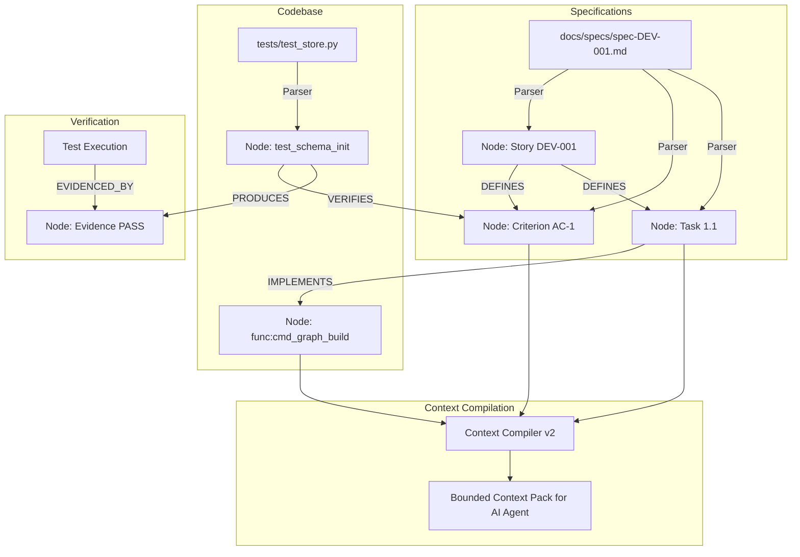

# Spec: DEV-003 — Graph-Driven Lifecycle & Context Compilation v2

> **Story ID:** DEV-003  
> **Epic:** Native Knowledge Engine — Delivery Intelligence & Semantics  
> **Status:** ✅ Done  
> **Estimate:** L  
> **Clarity:** `ready`  
> **Spec created:** 2026-09-09  

---

### Plan-Mode Spec Interview (findings)

#### Inferred (≥80% — no question asked)
| Checklist area | Finding |
|---|---|
| Domain Ingestion | Parse `docs/Master-Plan.md`, `docs/specs/*.md`, `docs/adr/*.md`, and evidence records directly into graph nodes (`story`, `criterion`, `task`, `adr`, `test`, `evidence`). |
| Context Compiler | Provide `agtoosa context compile <target>` to compile bounded, token-efficient subgraphs for active coding tasks. |
| Lifecycle Verification | Implement `agtoosa spec`, `agtoosa build`, `agtoosa review`, `agtoosa ship` with graph-backed invariant validation. |

---

## 1. Requirements

### Goal Contract
DEV-003 connects specifications, acceptance criteria, tasks, code symbols, and test evidence into the unified knowledge graph. It delivers Context Compilation v2 (slashing agent prompt token bloat by extracting bounded task subgraphs) and replaces text-based lifecycle gating with mathematical graph proof validation.

### User Stories
- **US-1**: As an AI coding agent, I want `agtoosa context compile <task_id>` to generate a minimal, high-signal context pack containing only the symbols, criteria, and tests linked to my task.
- **US-2**: As an engineer, I want `agtoosa review` to inspect the graph and flag any code modifications that are not linked to an approved task or lack test coverage.
- **US-3**: As a release manager, I want `agtoosa ship` to verify the mathematical proof chain (`Story → Criterion → Test → Evidence`) so that incomplete features cannot be released.

### EARS Acceptance Criteria
- **AC-1 (Doc Ingestion)**: WHEN `agtoosa graph build` runs, the engine SHALL parse `docs/Master-Plan.md`, `docs/specs/*.md`, and `docs/adr/*.md` into `story`, `criterion`, `task`, and `adr` nodes with relational edges.
- **AC-2 (Context Compilation)**: WHEN `agtoosa context compile <story_or_task>` is invoked, the engine SHALL extract the bounded subgraph (target node + immediate criteria + linked code symbols + dependent callers/callees) and output a clean Markdown context pack.
- **AC-3 (Review Verification)**: WHEN `agtoosa review` is invoked, the engine SHALL detect unlinked modified files, missing test relationships, and incomplete criteria.
- **AC-4 (Ship Verification Gate)**: WHEN `agtoosa ship <story_id>` is executed, the engine SHALL verify that every criterion node under the story is connected via a `VERIFIES` edge to a passing test and evidence; IF any criterion is missing verification, THEN release SHALL be blocked.

---

## 2. Architecture & Data Flow

---

## 3. Tasks & Dependency Waves

### Wave 1: Specification & Lifecycle Parser
- [x] **Task 1.1**: Implement `agtoosa/parser/doc_parser.py` extracting Story, Criterion, Task, and ADR nodes.
- [x] **Task 1.2**: Register `MarkdownDocParser` in `ParserEngine`.

### Wave 2: Context Compiler v2
- [x] **Task 2.1**: Implement `agtoosa/core/context_compiler.py` extracting bounded subgraphs and rendering clean prompt packs.
- [x] **Task 2.2**: Wire `agtoosa context compile <id>` CLI command.

### Wave 3: Graph-Driven Lifecycle Gating
- [x] **Task 3.1**: Implement `agtoosa/core/lifecycle.py` with review validation and mathematical proof verification for shipping.
- [x] **Task 3.2**: Wire `agtoosa spec`, `agtoosa build`, `agtoosa review`, and `agtoosa ship` CLI commands.

### Wave 4: Testing & Verification
- [x] **Task 4.1**: Unit tests for doc parser, context compiler, and lifecycle proof gates.
- [x] **Task 4.2**: Test compiling context and verifying proof for DEV-001 on the live codebase.
