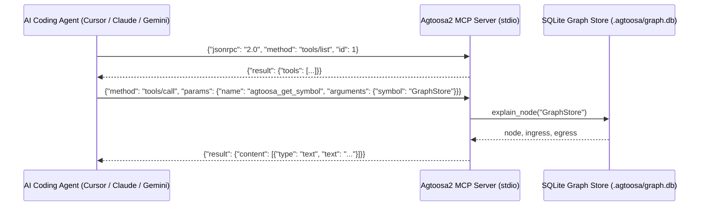

# Spec: DEV-004 — Native Model Context Protocol (MCP) Server

> **Story ID:** DEV-004  
> **Epic:** Native Knowledge Engine — Delivery Intelligence & Semantics  
> **Status:** 🟨 In Progress  
> **Estimate:** M  
> **Clarity:** `ready`  
> **Spec created:** 2026-09-09  

---

### Plan-Mode Spec Interview (findings)

#### Inferred (≥80% — no question asked)
| Checklist area | Finding |
|---|---|
| Protocol | Standard Model Context Protocol (JSON-RPC 2.0 over stdio). |
| Compatibility | Claude Code, Cursor, Windsurf, Copilot, and Gemini CLI. |
| Tool Surface | Graph search, symbol explanation, blast-radius impact, bounded context compilation, and ship verification. |

---

## 1. Requirements

### Goal Contract
DEV-004 provides a native Model Context Protocol (MCP) server (`agtoosa mcp`), allowing any AI coding assistant to communicate directly with the Agtoosa2 knowledge graph via structured JSON-RPC tools rather than scraping terminal output or reading raw markdown files.

### User Stories
- **US-1**: As an AI coding agent, I want to call `agtoosa_search_graph` via MCP so that I can discover symbols, stories, and files in the repository.
- **US-2**: As an AI assistant, I want to call `agtoosa_get_symbol` to retrieve exact code signatures, docstrings, callers, and callees.
- **US-3**: As an AI agent editing code, I want to call `agtoosa_query_impact` to assess what will break before applying a patch.
- **US-4**: As an assistant starting work on a task, I want to call `agtoosa_get_task_context` to receive a bounded, token-efficient prompt pack.

### EARS Acceptance Criteria
- **AC-1 (Protocol Conformance)**: WHEN `agtoosa mcp` is executed, the server SHALL listen on `stdin`, reply on `stdout`, and adhere to JSON-RPC 2.0 MCP standards.
- **AC-2 (Tool Discovery)**: WHEN an MCP `tools/list` request is received, the server SHALL return JSON schemas for `agtoosa_search_graph`, `agtoosa_get_symbol`, `agtoosa_query_impact`, `agtoosa_get_task_context`, and `agtoosa_verify_ship`.
- **AC-3 (Tool Execution)**: WHEN an MCP `tools/call` request is received with valid arguments, the server SHALL query the SQLite graph and return formatted results.

---

## 2. Architecture & Design

---

## 3. Tasks & Dependency Waves

### Wave 1: MCP Server Implementation
- [ ] **Task 1.1**: Implement `agtoosa/mcp/server.py` supporting standard JSON-RPC 2.0 message loop.
- [ ] **Task 1.2**: Implement handlers for `initialize`, `tools/list`, and `tools/call`.

### Wave 2: CLI Wiring & Testing
- [ ] **Task 2.1**: Wire `agtoosa mcp` CLI command.
- [ ] **Task 2.2**: Write unit tests in `tests/test_mcp.py` exercising tool discovery and execution via mock stdio.
