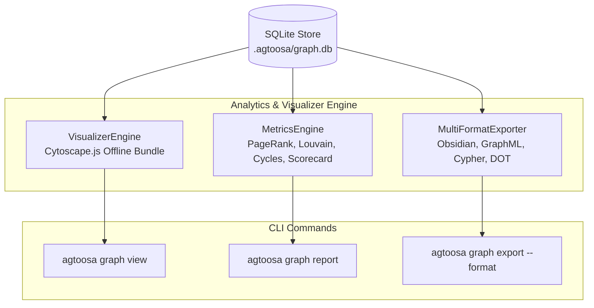

# Spec: DEV-005 — Interactive Architecture Exploration & Visualizer

> **Story ID:** DEV-005  
> **Epic:** Native Knowledge Engine — Visualization & Parity Breadth  
> **Status:** ✅ Done  
> **Estimate:** L  
> **Clarity:** `ready`  
> **Spec created:** 2026-09-09  

---

### Plan-Mode Spec Interview (findings)

#### Inferred (≥80% — no question asked)
| Checklist area | Finding |
|---|---|
| Offline Guarantee | Standalone HTML with bundled Cytoscape.js; zero external server, port binding, or CDN dependencies. |
| Graph Analytics | PageRank, circular dependency detection, community clustering, and architectural health scorecard. |
| Export Formats | JSON (default), Obsidian Markdown Vault (`[[wikilinks]]`), GraphML (XML), Cypher (Neo4j), DOT (Graphviz). |
| Platform Parity | Fully integrated with unified `agtoosa graph view`, `report`, and `export` CLI. |

---

## 1. Requirements

### Goal Contract
DEV-005 delivers interactive architectural visualization and deep graph analysis for the Agtoosa2 Knowledge Engine. It empowers engineers and AI agents to visually explore codebases, audit circular dependencies, evaluate architectural coupling/cohesion, and export knowledge graphs into Obsidian vaults, GraphML, Cypher, and DOT diagrams.

### User Stories
- **US-1**: As a software architect, I want to run `agtoosa graph view` to generate a self-contained, offline interactive graph visualization that I can open in any browser.
- **US-2**: As an engineer refactoring modules, I want to run `agtoosa graph report` to detect circular dependencies and identify high-centrality bottleneck symbols.
- **US-3**: As a technical writer or developer using knowledge bases, I want to run `agtoosa graph export --format obsidian` to generate a browsable Obsidian vault with interconnected Markdown wikilinks.
- **US-4**: As a data engineer, I want to export the knowledge graph into GraphML, Cypher, and DOT formats to visualize and query it in external tooling (Gephi, Neo4j, Graphviz).

### EARS Acceptance Criteria
- **AC-1 (Offline HTML Viewer)**: WHEN `agtoosa graph view` is executed, the engine SHALL produce a standalone HTML file containing embedded Cytoscape.js and graph JSON data without external CDN requirements.
- **AC-2 (Interactive Inspector)**: WHEN a user clicks a node in the visualizer, the UI SHALL display a side inspector containing the node's name, type, file location, docstring, and incoming/outgoing edges.
- **AC-3 (Cycle Detection)**: WHEN `agtoosa graph report` is executed on a codebase containing circular references, the engine SHALL output all directed cycles with exact symbol paths.
- **AC-4 (Architectural Metrics)**: WHEN `agtoosa graph report` runs, the engine SHALL calculate PageRank importance, community clusters, coupling/cohesion ratios, and unverified functions.
- **AC-5 (Obsidian Export)**: WHEN `agtoosa graph export --format obsidian` is executed, the engine SHALL create a folder of Markdown notes with YAML frontmatter and `[[target]]` wikilinks matching the graph topology.
- **AC-6 (Standard Schema Exports)**: WHEN `agtoosa graph export` is called with `--format graphml|cypher|dot`, the engine SHALL output well-formed GraphML XML, Cypher statements, or Graphviz DOT syntax.

---

## 2. Architecture & Component Flow

---

## 3. Tasks & Dependency Waves

### Wave 1: Core Analytics & Exporters
- [x] **Task 1.1**: Implement `agtoosa/graph/metrics.py` (PageRank, Tarjan cycle detection, community clustering, health scorecard).
- [x] **Task 1.2**: Implement `agtoosa/graph/export.py` (Obsidian, GraphML, Cypher, DOT serializers).

### Wave 2: Interactive Visualizer & CLI Wiring
- [x] **Task 2.1**: Implement `agtoosa/graph/visualizer.py` (Self-contained offline HTML generator with bundled Cytoscape.js).
- [x] **Task 2.2**: Wire `view`, `report`, and expanded `export` commands into `agtoosa/cli/graph_cmd.py` and `agtoosa/cli/main.py`.

### Wave 3: Testing & Verification
- [x] **Task 3.1**: Write unit tests for graph metrics, cycles, and health scoring in `tests/test_metrics.py`.
- [x] **Task 3.2**: Write unit tests for multi-format export in `tests/test_export.py`.
- [x] **Task 3.3**: Write unit tests for visualizer generation in `tests/test_visualizer.py`.
- [x] **Task 3.4**: Test end-to-end on Agtoosa2 repository itself.
