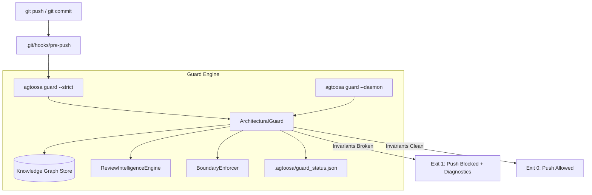

# Spec: DEV-024 — Pre-Push Architectural Daemon & Drift Linter

> **Story ID:** DEV-024  
> **Milestone:** Milestone 9 (Autonomous Code Actions & 2-Way Studio Sync — v0.4.1)  
> **Status:** 🟡 In Progress  
> **Impact Rating:** 72 / 100  
> **Estimate:** M  
> **Spec Created:** 2026-09-13  

---

## 1. Requirements & Goal Contract

### Goal Contract
DEV-024 shifts architectural invariant enforcement left into the local development environment. It introduces `agtoosa guard`, a pre-push & pre-commit architectural guard daemon and drift linter that prevents circular dependency regressions, layer boundary violations, and blast radius blowouts before code is pushed to remote repositories. It couples this with a background monitoring daemon that produces a sub-millisecond status cache (`.agtoosa/guard_status.json`), ensuring zero-latency Git hook execution.

### User Stories
- **US-1**: As a developer running `git push`, I want a `pre-push` Git hook that verifies graph invariants and aborts the push if any cyclic dependencies or layer boundary breaches are introduced.
- **US-2**: As an engineer modifying foundational core modules, I want to be alerted if my changes exceed a configurable blast radius threshold (e.g. `--max-blast-radius 5`) so I do not inadvertently break downstream dependents.
- **US-3**: As a developer in a fast editing loop, I want a background daemon (`agtoosa guard --daemon`) that continuously updates an invariant health cache so my pre-push and pre-commit checks run in under 15ms.
- **US-4**: As an architect or CI engineer, I want `agtoosa guard --status` and `agtoosa guard --json` to inspect the live health of the workspace with structured JSON output for tooling.

### EARS Acceptance Criteria
- **AC-1 (Pre-Push Hook Installation)**: WHEN `agtoosa guard --install-hooks` is executed in a repository with `.git/`, the tool SHALL install `pre-push` (and `pre-commit`) hooks calling `agtoosa guard --strict`.
- **AC-2 (Zero Circular Dependencies)**: WHEN `agtoosa guard` runs on a codebase containing circular references, the command SHALL exit with code `1` (under `--strict` or default blocking rules) and report the exact cycle paths.
- **AC-3 (Layer Boundary Invariants)**: WHEN lower architectural tiers (e.g., `core`) import higher architectural tiers (e.g., `cli` or `mcp`), `agtoosa guard` SHALL detect the layer boundary violation and block the push.
- **AC-4 (Blast Radius Circuit Breaker)**: WHEN modified files have an upstream dependent count exceeding `--max-blast-radius <int>` (default: 5), `agtoosa guard` SHALL issue a blast radius finding and block if `--strict` is set.
- **AC-5 (Sub-Millisecond Daemon Cache)**: WHEN `agtoosa guard --daemon` runs, it SHALL watch for file changes, evaluate graph invariants, and persist the status into `.agtoosa/guard_status.json`.
- **AC-6 (Cache Status Inspection)**: WHEN `agtoosa guard --status` is called, it SHALL read `.agtoosa/guard_status.json` and return the latest recorded health verdict without performing a cold graph traversal.

---

## 2. Architecture & Data Flow



---

## 3. CLI Interface

```bash
# Direct audit
agtoosa guard [--strict] [--max-blast-radius 5] [--base-ref origin/main] [--json]

# Daemon mode
agtoosa guard --daemon [--interval 3]

# Hook management
agtoosa guard --install-hooks
agtoosa guard --uninstall-hooks

# Status check
agtoosa guard --status [--json]
```
