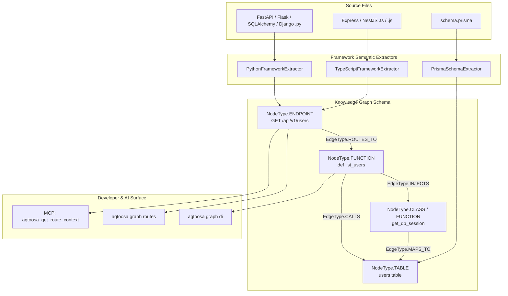

# Spec: DEV-025 — Framework Dependency Injection & Dynamic Routes

> **Story ID:** DEV-025  
> **Milestone:** Milestone 10 (Deep Polyglot Framework Semantics & Distributed Event Lineage — v0.4.2)  
> **Status:** ✅ Done  
> **Impact Rating:** 96 / 100 (#1 Highest Strategic Priority)  
> **Estimate:** L  
> **Spec Created:** 2026-09-13  

---

## 1. Requirements & Goal Contract

### Goal Contract
DEV-025 elevates Agtoosa from a static syntax AST parser into a true runtime framework architecture graph. It extracts and models framework-level Dependency Injection (DI) containers, dynamic route endpoints, and Object-Relational Mapping (ORM) relationships for modern Python (FastAPI, Flask, SQLAlchemy, Django) and TypeScript (Express, NestJS, Prisma) codebases. It exposes first-class `Endpoint` and `Table` nodes, `ROUTES_TO`, `INJECTS`, and `MAPS_TO` graph edges, CLI query commands (`agtoosa graph routes`, `agtoosa graph di`), and AI agent MCP context tools.

### User Stories
- **US-1**: As a developer or AI assistant, I want to query `agtoosa graph routes` to inspect all HTTP API endpoints across the workspace, along with their HTTP methods, path parameters, and bound controller functions.
- **US-2**: As an AI coding agent via MCP (`agtoosa_get_route_context`), I want to provide an endpoint path (e.g. `POST /api/v1/orders`) and receive the entire architectural execution chain: bound handler, injected database sessions, service providers, and ORM entity models.
- **US-3**: As an engineer refactoring services, I want to run `agtoosa graph di <symbol>` to see all dependency-injected providers and consumers (e.g. FastAPI `Depends(get_db)` or NestJS `@Injectable()`).
- **US-4**: As a database or backend architect, I want SQLAlchemy and Prisma models mapped directly to underlying database table nodes (`table:users`) with `MAPS_TO` edges, linking database tables to repository queries.

### EARS Acceptance Criteria
- **AC-1 (FastAPI & Flask Route Extraction)**: WHEN a Python file contains route decorators (`@app.get(...)`, `@router.post(...)`, `@bp.route(...)`), the engine SHALL generate an `Endpoint` node with HTTP method, URL path, and a `ROUTES_TO` edge pointing to the handler function.
- **AC-2 (FastAPI Dependency Injection)**: WHEN a Python handler or service uses `Depends(provider)` or `Annotated[..., Depends(provider)]`, the engine SHALL create an `INJECTS` edge from the handler to the provider function/class.
- **AC-3 (SQLAlchemy ORM Mapping)**: WHEN a Python class defines `__tablename__` or inherits from `Base`/`DeclarativeBase`, the engine SHALL create a `Table` node and link the class via a `MAPS_TO` edge.
- **AC-4 (Express & NestJS Route Extraction)**: WHEN JavaScript/TypeScript files define Express routes (`app.get(...)`, `router.post(...)`) or NestJS controllers (`@Controller(...)`, `@Get(...)`), the engine SHALL extract normalized `Endpoint` nodes and `ROUTES_TO` edges.
- **AC-5 (NestJS Dependency Injection)**: WHEN a NestJS service has `@Injectable()` and constructor injection (`constructor(private svc: Service)`), the engine SHALL generate an `INJECTS` edge between the consumer and injected service.
- **AC-6 (Prisma Schema Extraction)**: WHEN `schema.prisma` is present in the workspace, the engine SHALL parse models, fields, and `@relation` definitions into `Table` nodes and relational edges.
- **AC-7 (CLI Commands)**: WHEN `agtoosa graph routes` or `agtoosa graph di <symbol>` is executed, the CLI SHALL display formatted tables or output structured JSON when `--json` is specified.
- **AC-8 (MCP Tool Context)**: WHEN an AI assistant invokes `agtoosa_get_route_context`, the MCP server SHALL return the complete contextual subgraph from endpoint to handler, injected providers, and ORM tables.

---

## 2. Architecture & Data Flow



---

## 3. CLI & MCP Tool Interface

```bash
# Browse detected API routes
agtoosa graph routes [--method GET|POST|...] [--json]

# Trace dependency injection chains
agtoosa graph di <symbol_name> [--json]

# MCP Tool: agtoosa_get_route_context
# Input: { "path": "/api/v1/users", "method": "GET" }
# Output: Detailed context pack with handler code, injected dependencies, and ORM tables
```
