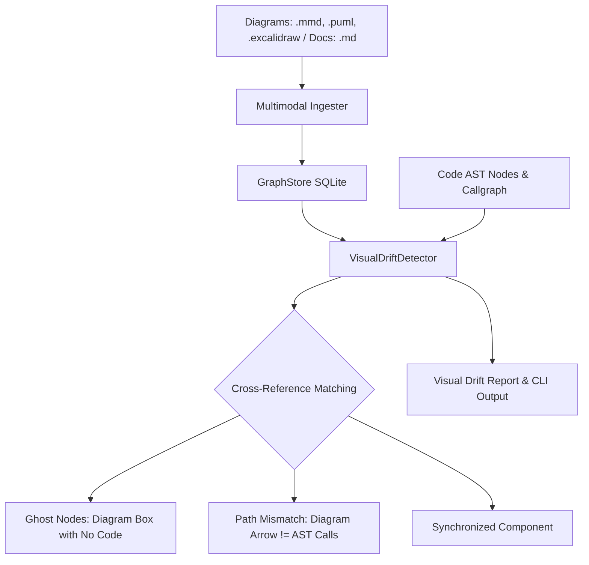

# Spec: DEV-033 — Multimodal Knowledge Ingestion & Visual-to-Code Architecture Drift Verification

> **Story ID:** DEV-033  
> **Parent Milestone:** Milestone 14 (v0.7.0)  
> **Status:** 📋 Ready for Implementation  
> **Impact Rating:** 95 / 100  
> **Dependencies:** EPIC-001 (Foundation Gate Cleared: DEV-040–049)  
> **Spec Created:** 2026-09-14  

---

## 1. Requirements & Goal Contract

### Goal Contract
DEV-033 delivers multimodal knowledge ingestion and visual-to-code architecture drift verification. While existing tools treat architecture diagrams and documentation as isolated images or passive text descriptions, DEV-033 ingests structured/unstructured specifications (PDF documents, Markdown, web URLs, Mermaid/PlantUML/Excalidraw diagrams) and extracts conceptual nodes and edges. It then executes the `VisualDriftDetector` to mathematically compare visual architecture assertions against the concrete SQLite AST callgraph, flagging ghost nodes (visual components lacking code implementation) and path mismatches (divergent connection topologies).

### User Stories
- **US-1**: As a software architect, I want to ingest Mermaid, PlantUML, and technical documentation into the Agtoosa knowledge graph so conceptual models exist alongside source code symbols.
- **US-2**: As a tech lead, I want to run `agtoosa graph drift visual` to detect visual specification drift, finding diagram components that were never implemented (ghost nodes) and connection paths that do not reflect reality in the AST.
- **US-3**: As an AI coding agent, I want structured MCP and CLI tools (`agtoosa ingest`, `agtoosa add`, `agtoosa_check_visual_drift`) to reconcile high-level architecture designs with actual repository code.

### Acceptance Criteria (EARS)
- **AC-33.1 (Multimodal Ingestion)**: WHEN `agtoosa ingest` is invoked with a Markdown file, PDF text, or diagram file (`.mmd`, `.puml`, `.excalidraw`), the ingester SHALL extract document/diagram nodes and relationship edges into the graph store.
- **AC-33.2 (Visual-to-Code Drift Detection)**: WHEN `VisualDriftDetector.detect_drift` is run, the engine SHALL cross-reference visual entities against concrete AST nodes (`CLASS`, `FUNCTION`, `SERVICE`, `ENDPOINT`), reporting ghost nodes and path mismatches.
- **AC-33.3 (CLI & Exit Code Enforcement)**: WHEN `agtoosa graph drift visual --strict` is executed in CI, the command SHALL exit with non-zero status (1) if critical visual drift or ghost nodes are detected, and 0 when visual diagrams are synchronized with code.

---

## 2. Architecture & Data Flow

---

## 3. Implementation Verification
- Ingester: `agtoosa/parser/multimodal/`
- Drift Engine: `agtoosa/graph/visual_drift.py`
- CLI Surface: `agtoosa ingest`, `agtoosa add`, `agtoosa graph drift visual`
- Test Suite: `tests/test_multimodal_drift.py`
