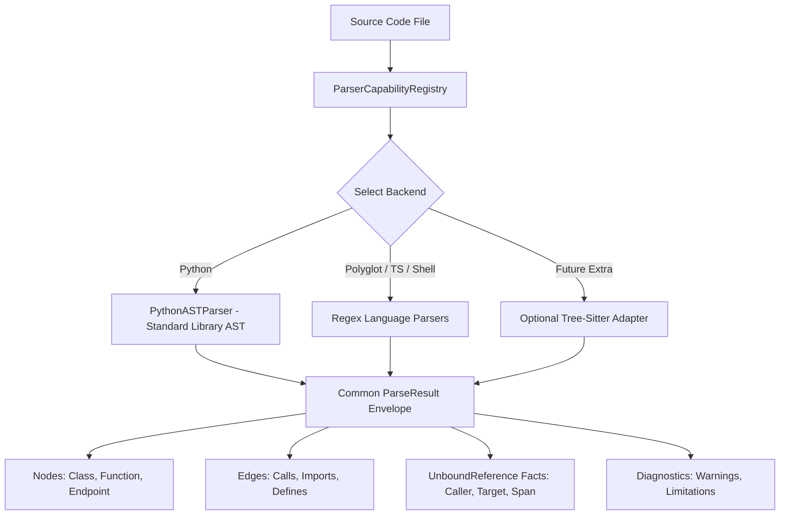

# Spec: DEV-040 — Parser Coverage and Language Adapters

> **Story ID:** DEV-040  
> **Parent Epic:** [EPIC-001 — Trusted Knowledge Intelligence](epic-001-trusted-knowledge-intelligence.md)  
> **Milestone:** Foundation Gate  
> **Status:** ✅ Done  
> **Impact Rating:** 97 / 100  
> **Research Basis:** Finding R-01 (regex vs AST coverage), R-11  
> **Spec Created:** 2026-09-13  

---

## 1. Requirements & Goal Contract

### Goal Contract
DEV-040 addresses the binding constraint identified in research finding R-01: while Python extraction uses full standard-library AST, other languages (JS/TS, Go, Rust, Java/Kotlin, C/C++, C#, Shell, SQL DDL, Dockerfile, Prisma) currently operate on regex patterns without tree-sitter integration or explicit capability bounds. DEV-040 establishes an explicit, transparent capability registry, defines a common `ParseResult` envelope with unbound reference facts and diagnostics, and provides an offline-safe foundation with visible limitations rather than silently fabricated edges.

### User Stories
- **US-1**: As an AI coding agent or engineer, I want to query `agtoosa graph capabilities` to inspect exact parser backends, supported extensions, and coverage tiers for all 12 language families.
- **US-2**: As a static analysis consumer, I want parser adapters to produce a common `ParseResult` separating resolved entities, unbound references, and parser diagnostics (e.g. regex limitations, dynamic construct warnings).
- **US-3**: As a system administrator in an offline/minimal environment, I want missing grammar libraries to leave the dependency-free core fully functional, with capability reporting clearly marking limited fallback mode.

### Acceptance Criteria (EARS)
- **AC-01 (Explicit Capability Registry)**: WHEN the system initializes, the `ParserCapabilityRegistry` SHALL record explicit entries for all 12 supported families, declaring active backend, coverage tier (`full_ast` vs `limited_fallback`), extracted node/edge types, and documented limitations.
- **AC-02 (Common Parse Envelope)**: WHEN any parser adapter processes a source file, it SHALL return a `ParseResult` containing extracted nodes, edges, `unbound_references`, `diagnostics`, `parser_name`, `coverage_tier`, and `source_hash`.
- **AC-03 (Missing Grammar Graceful Degradation)**: WHEN optional grammar packages are absent, the parser subsystem SHALL fall back to standard-library/regex extraction without crashing and mark coverage as `limited_fallback`.

---

## 2. Architecture & Data Flow

---

## 3. Implementation Verification
- Registry implementation: `agtoosa/parser/capabilities.py`
- Test suite: `tests/test_parser_capabilities.py` (4 tests passing)
- Multi-language coverage verification: `tests/test_evaluation_fixtures.py`
