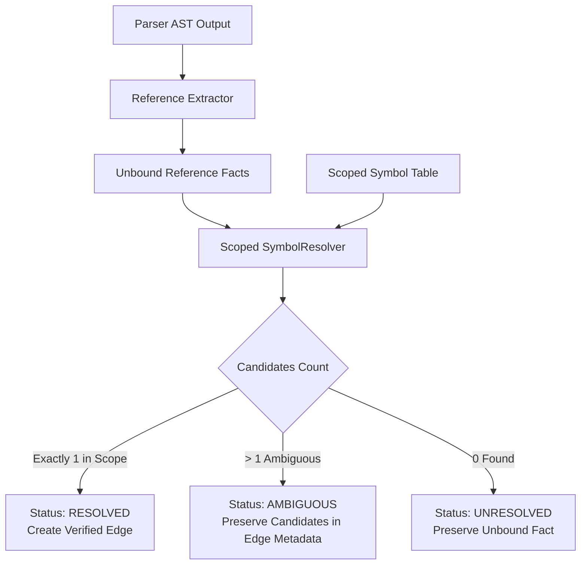

# Spec: DEV-041 — Scoped Identity and Honest Resolution

> **Story ID:** DEV-041  
> **Parent Epic:** [EPIC-001 — Trusted Knowledge Intelligence](epic-001-trusted-knowledge-intelligence.md)  
> **Milestone:** Foundation Gate  
> **Status:** ✅ Done  
> **Impact Rating:** 94 / 100  
> **Research Basis:** Findings R-02 (name collisions produce wrong links), R-03 (hidden query ambiguity), R-05  
> **Dependencies:** DEV-040  
> **Spec Created:** 2026-09-13  

---

## 1. Requirements & Goal Contract

### Goal Contract
DEV-041 resolves the architectural defects where identical symbol names across files or classes collided into arbitrary global links, and where queries arbitrarily selected the first result using SQL `LIMIT 1`. DEV-041 implements scope-aware resolution using lexical/module/file scoping, preserves original reference facts, and returns explicit candidate sets when a reference or query is ambiguous without guessing action targets.

### User Stories
- **US-1**: As an AI coding agent, when I query a symbol name that exists in multiple modules (e.g. `validate`), I want to receive an explicit list of candidate symbols with their file paths and scopes rather than an arbitrary single hit.
- **US-2**: As an engineer, when a module calls an imported function, I want the call edge to link specifically to the imported module's definition, not to an identically-named function in an unrelated file.
- **US-3**: As a refactoring tool, when a symbol cannot be resolved unambiguously, I want the edge metadata to preserve the original unresolved call target and candidate list so the reference fact is never lost.

### Acceptance Criteria (EARS)
- **AC-04 (Scoped Disambiguation)**: WHEN multiple classes or functions share the same base name in different files or scopes, the resolver SHALL NOT overwrite previous mappings in a global dictionary, and SHALL maintain distinct candidate sets.
- **AC-05 (Honest Query Ambiguity)**: WHEN `resolve_node_candidates` is queried for an ambiguous symbol, the system SHALL return `status: AMBIGUOUS` with all matching candidates, refusing to guess a single target.
- **AC-06 (Reference Fact Preservation)**: WHEN resolving cross-file calls, original reference facts SHALL be preserved in edge metadata, enabling recomputation when target definitions change.

---

## 2. Architecture & Data Flow

---

## 3. Implementation Verification
- Module: `agtoosa/parser/resolver.py`
- Query integration: `agtoosa/graph/query.py`
- Test suite: `tests/test_symbol_resolution.py`
