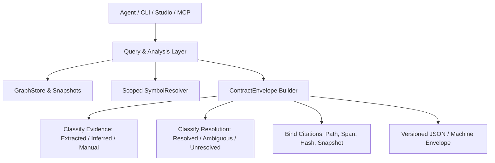

# Spec: DEV-043 — Versioned Explainable Interfaces

> **Story ID:** DEV-043  
> **Parent Epic:** [EPIC-001 — Trusted Knowledge Intelligence](epic-001-trusted-knowledge-intelligence.md)  
> **Milestone:** Foundation Gate  
> **Status:** 📋 Ready for Implementation  
> **Impact Rating:** 92 / 100  
> **Research Basis:** Findings R-03 (query ambiguity hidden), R-08 ("semantic" vectors are hashed text features)  
> **Dependencies:** DEV-040, DEV-041, DEV-042  
> **Spec Created:** 2026-09-14  

---

## 1. Requirements & Goal Contract

### Goal Contract
DEV-043 establishes a standardized, versioned machine-readable response envelope across all Agtoosa2 query, analysis, and serving surfaces. It replaces unverified single-hit guessing and unexplained scalar confidences with honest semantics: explicitly separating evidence provenance (extracted vs inferred vs manual), reference resolution status (resolved vs ambiguous vs unresolved), citation anchors (path, span, content hash, snapshot ID), and freshness/completeness states. It also accurately labels feature-hashed embeddings and introduces `agtoosa graph capabilities` and `agtoosa graph verify` CLI commands.

### User Stories
- **US-1**: As an AI coding agent or IDE client, when I invoke a graph query or explain endpoint, I want a structured envelope with contract version, resolution status, candidate set, snapshot ID, and citations, so I can act with verified knowledge.
- **US-2**: As a developer running CI/CD or local checks, I want `agtoosa graph verify` to audit graph snapshot freshness against the working directory and exit with non-zero when source files have drifted or been modified.
- **US-3**: As a software architect evaluating retrieval, I want dense vector retrieval to be accurately identified as hashed character n-gram and token feature embeddings, avoiding false claims of neural semantic models.
- **US-4**: As a platform integrator, I want `agtoosa graph capabilities` to inspect active parser backends, coverage tiers, and dialect limitations across all supported languages in human and JSON formats.

### Acceptance Criteria (EARS)
- **AC-11 (Standard Machine Envelope)**: WHEN any graph query, resolution, or explanation API is called in structured mode, the response SHALL adhere to `ContractEnvelope`, including `contract_version`, `snapshot_id`, `freshness`, `completeness`, `resolution_status`, `citations`, and `diagnostics`.
- **AC-12 (CLI Integrity Verification)**: WHEN `agtoosa graph verify` is executed, the CLI SHALL verify file fingerprints against current disk contents and latest snapshot; IF source files differ or database is missing/corrupted, it SHALL exit with non-zero code and display specific file diffs.
- **AC-13 (Accurate Vector Labelling)**: WHEN vector embeddings or status are queried, the system SHALL explicitly identify the algorithm as `feature_hashing_token_ngram` or `HashedFeatureEmbeddingEngine` without claiming unverified deep neural semantics.

---

## 2. Architecture & Data Contract

### Contract Fields
- `contract_version`: Semver string (e.g. `"1.0.0"`).
- `snapshot_id`: Identifier of the active graph snapshot.
- `freshness`: `"fresh"` | `"stale"` | `"unknown"`.
- `completeness`: `"complete"` | `"partial"` | `"empty"`.
- `resolution_status`: `ResolutionStatus` enum (`RESOLVED`, `AMBIGUOUS`, `UNRESOLVED`).
- `data`: Payload of the specific query or operation.
- `candidates`: List of disambiguation candidate dictionaries.
- `citations`: List of `Citation` records with file path, line span, content hash, snapshot id.
- `diagnostics`: List of warning or error strings.
- `coverage_summary`: Language/parser coverage summary.

---

## 3. Implementation Verification
- Core models: `agtoosa/core/model.py`
- Embeddings labelling: `agtoosa/graph/embeddings.py`
- CLI commands: `agtoosa/cli/graph_cmd.py` and `agtoosa/cli/main.py`
- Automated test suite: `tests/test_graph_contract.py`
