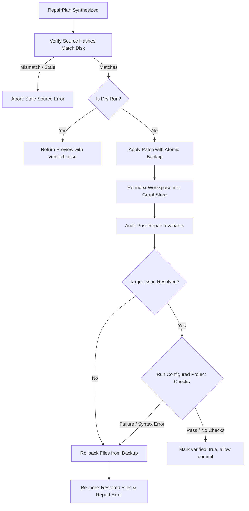

# Spec: DEV-044 — Verified Repair and Conservative Dead-Code Actions

> **Story ID:** DEV-044  
> **Parent Epic:** [EPIC-001 — Trusted Knowledge Intelligence](epic-001-trusted-knowledge-intelligence.md)  
> **Milestone:** Foundation Gate  
> **Status:** ✅ Done  
> **Impact Rating:** 93 / 100  
> **Research Basis:** Finding R-10 (repair verification overstates evidence; dry runs claimed verified; missing reindex & project checks)  
> **Dependencies:** DEV-043  
> **Spec Created:** 2026-09-14  

---

## 1. Requirements & Goal Contract

### Goal Contract
DEV-044 establishes rigorous verification for autonomous repair and dead-code pruning actions. Prior implementations returned `verified: true` for dry runs without modifying or testing files, failed to bind patch plans to specific source file hashes, did not re-index after patch application, and did not run project test suites before declaring success. DEV-044 binds every patch to source hashes, marks dry runs strictly as unverified previews (`verified: false`), executes mandatory workspace reindexing, validates resolution of the specific diagnosed finding without introducing new errors, executes configured verification commands (e.g. tests/typechecks), and guarantees clean rollback on any failure.

### User Stories
- **US-1**: As an AI coding agent, when I execute a dry-run repair preview, I want the response to explicitly declare `verified: false` so I do not mistake a preview for verified execution.
- **US-2**: As a developer running autonomous PR repairs, when a patch is applied, I want the agent to verify that the file's current content matches the hash at plan synthesis time; if the file changed in the interim, the repair must be rejected as stale.
- **US-3**: As a tech lead, when dead-code or decoupling patches are applied, I want Agtoosa2 to reindex the workspace, verify that the targeted issue is absent, run configured project test commands, and automatically rollback the entire patch if tests fail.

### Acceptance Criteria (EARS)
- **AC-14 (Conservative Previews & Source Binding)**: WHEN `apply_and_verify` is run with `dry_run=True`, the response SHALL have `verified: False`. WHEN a patch plan is applied, the engine SHALL check that each target file's content hash matches the `source_hashes` recorded at plan creation; IF any hash differs, application SHALL abort without modifying files.
- **AC-15 (Post-Apply Reindexing & Specific Issue Audit)**: WHEN a patch is applied to disk, the engine SHALL re-index the workspace and verify the absence of the specific target issue and absence of new critical violations.
- **AC-16 (Rollback on Test or Check Failure)**: WHEN configured verification commands (e.g., test runner) fail post-apply, the engine SHALL roll back all modified files to their exact pre-patch backups, re-sync graph state, and report failure with `verified: False`.

---

## 2. Architecture & Execution Flow

---

## 3. Implementation Verification
- Engine: `agtoosa/repair/agent.py`
- Automated test suite: `tests/test_repair_verification.py`
