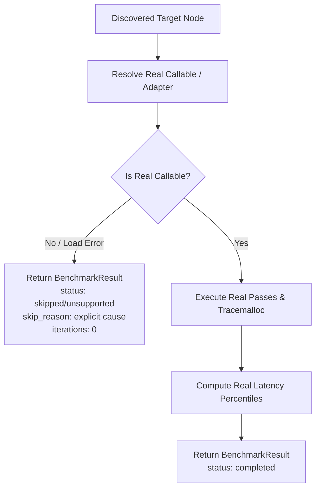

# Spec: DEV-045 — Real Benchmark Evidence

> **Story ID:** DEV-045  
> **Parent Epic:** [EPIC-001 — Trusted Knowledge Intelligence](epic-001-trusted-knowledge-intelligence.md)  
> **Milestone:** Foundation Gate  
> **Status:** ✅ Done  
> **Impact Rating:** 91 / 100  
> **Research Basis:** Finding R-09 (benchmark fallback substitutes synthetic_probe; arbitrary code execution on import)  
> **Dependencies:** DEV-043  
> **Spec Created:** 2026-09-14  

---

## 1. Requirements & Goal Contract

### Goal Contract
DEV-045 eliminates synthetic fallback benchmarks that fabricate latency distributions when symbols cannot be resolved as zero-argument callables. In place of fake synthetic execution, DEV-045 requires genuine runnable benchmark targets or explicit `skipped` / `unsupported` status reporting with accurate causal diagnostics. It guarantees that synthetic workloads are never counted as application evidence, maintaining zero-trust truthfulness in CI and reporting.

### User Stories
- **US-1**: As a performance engineer, when a benchmark cannot safely resolve or execute a symbol, I want the harness to report `status: "unsupported"` or `status: "skipped"` with an explicit reason, rather than executing a synthetic arithmetic loop and pretending it measures my symbol.
- **US-2**: As an automated CI system, when benchmarking PR diffs, I want benchmark metrics to reflect only real executed measurements so regressions are never obscured or fabricated by synthetic proxies.

### Acceptance Criteria (EARS)
- **AC-17 (No Synthetic Probes)**: WHEN a callable cannot be safely resolved or executed for a target symbol, the harness SHALL NOT substitute a synthetic probe or mock computation, and SHALL return `BenchmarkResult` with `status: "unsupported"` or `status: "skipped"` with an explicit `skip_reason`.
- **AC-18 (Controlled Invocation)**: WHEN a benchmark is executed for a valid callable, the harness SHALL measure real execution time and memory without unverified synthetic loop fallbacks.

---

## 2. Architecture & Data Flow

---

## 3. Implementation Verification
- Module: `agtoosa/benchmark/harness.py`
- Models: `agtoosa/benchmark/models.py`
- Test suite: `tests/test_benchmark.py`
