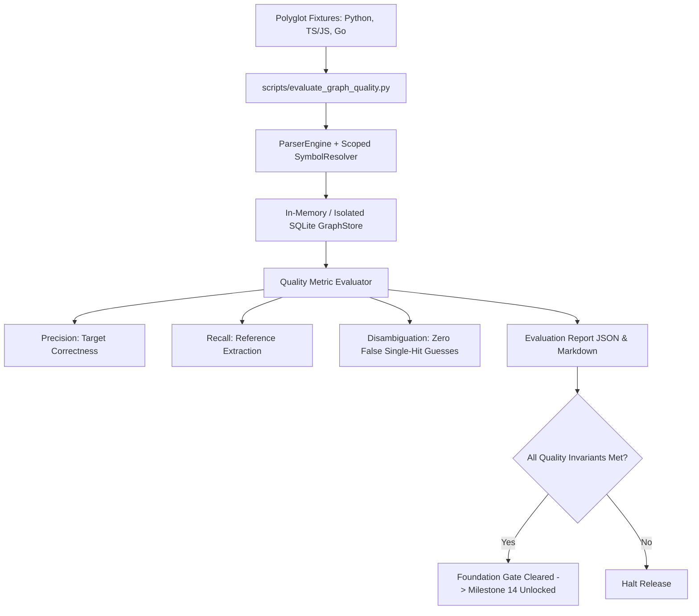

# Spec: DEV-046 — Held-Out Evaluation, Parity Ledger, and Release Gate

> **Story ID:** DEV-046  
> **Parent Epic:** [EPIC-001 — Trusted Knowledge Intelligence](epic-001-trusted-knowledge-intelligence.md)  
> **Milestone:** Foundation Gate (Epic Release Gate)  
> **Status:** 📋 Ready for Implementation  
> **Impact Rating:** 95 / 100  
> **Research Basis:** Findings R-01–11 (honest parity ledger, real measurement, version alignment)  
> **Dependencies:** DEV-040, DEV-041, DEV-042, DEV-043, DEV-044, DEV-045, DEV-047, DEV-048, DEV-049  
> **Spec Created:** 2026-09-14  

---

## 1. Requirements & Goal Contract

### Goal Contract
DEV-046 serves as the definitive release gate and held-out evaluation runner for EPIC-001 (Trusted Knowledge Intelligence). It replaces speculative marketing parity claims with an automated, reproducible held-out evaluation runner (`scripts/evaluate_graph_quality.py`) that tests Agtoosa2 against the polyglot ground truth fixtures established in DEV-046/DEV-041 (`tests/fixtures/trusted_graph/`). It calculates precision, recall, and zero-wrong-target disambiguation rates across Python, TypeScript/JavaScript, and Go. It also reconciles repository version declarations (`pyproject.toml` and `agtoosa.__version__`) to `0.6.0`, establishes an immutable parity ledger against Graphify v8, and unlocks Milestone 14.

### User Stories
- **US-1**: As a lead architect, I want an automated script `scripts/evaluate_graph_quality.py` that computes exact precision, recall, and disambiguation metrics across held-out fixtures to prove graph truthfulness.
- **US-2**: As a package maintainer, I want version declarations across `pyproject.toml`, `agtoosa/__init__.py`, and documentation to be strictly synchronized to `0.6.0` once all foundation criteria pass.
- **US-3**: As an engineering team, I want an evidence-backed Capability Matrix that clearly states measured capabilities versus limitations without unverified claims.

### Acceptance Criteria (EARS)
- **AC-19 (Held-out Evaluation Runner)**: WHEN `scripts/evaluate_graph_quality.py` is executed, it SHALL parse and index the ground truth polyglot evaluation fixtures, verify that every designated ambiguous case resolves zero wrong concrete targets, and report precision, recall, and F1 metrics.
- **AC-20 (Release Gate Reconciliation)**: WHEN all EPIC-001 stories (DEV-040 through DEV-049) are complete and tested, package versions in `pyproject.toml` and `agtoosa/__init__.py` SHALL be synchronized to `0.6.0`, passing distribution manifest checks.
- **AC-21 (Honest Parity Ledger)**: Documentation in `docs/Capability-Matrix.md` and `docs/Master-Plan.md` SHALL record audited capabilities and evidence, acknowledging regex vs AST differences and feature-hashed vs learned embeddings.

---

## 2. Architecture & Evaluation Framework

---

## 3. Implementation Verification
- Evaluation Script: `scripts/evaluate_graph_quality.py`
- Package Version: `pyproject.toml` and `agtoosa/__init__.py`
- Test suite: `tests/test_evaluation_fixtures.py` and `tests/test_distribution.py`
